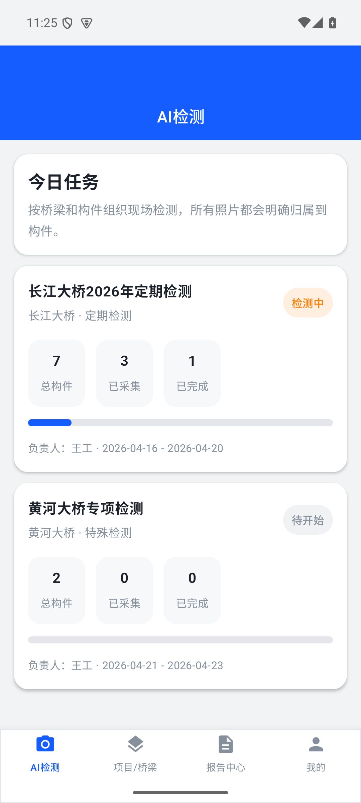
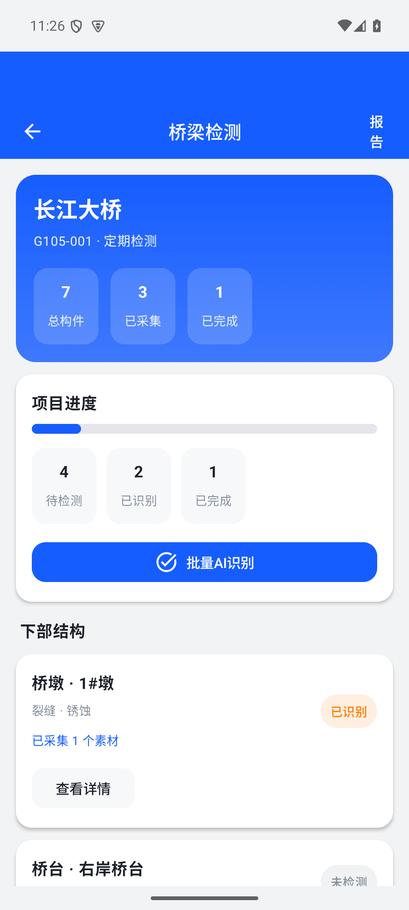

# BridgeAI

桥检 AI（BridgeAI）是一个面向桥梁检测工程师的 Android 应用原型，围绕现场采集、AI 识别、人工复核、报告生成与离线同步做了一套可体验的业务流程。

当前仓库主要包含：

- `android-app/`：Android Compose 原型工程
- `release-assets/`：对外体验包与校验信息
- 根目录多份 `.md`：产品、技术、接口与交互设计文档

## 当前可体验能力

- 四个主 Tab：任务、桥梁、报告、我的
- 项目列表与桥梁详情浏览
- 构件拍照/素材采集
- AI 识别结果查看与人工编辑
- 修复建议优化弹层
- 报告预览、报告编辑、报告上报
- 离线同步、一键同步、自动同步策略、失败重试、等待 Wi‑Fi 提示

## 界面预览

首页示意：



项目页示意：



## 工程信息

- App 名称：`BridgeAI`
- 包名：`com.bridgeai.app`
- 技术栈：Kotlin + Jetpack Compose + Navigation Compose
- 最低 Android 版本：`minSdk 29`
- 目标版本：`targetSdk 35`

## 本地运行

1. 安装 Android Studio。
2. 打开 `android-app/` 目录。
3. 配置本机 Android SDK。
4. 运行：

```bash
./gradlew :app:assembleDebug
```

## 体验安装包

当前仓库提供一个可直接分发体验的 debug 安装包：

- APK 文件：[`release-assets/bridgeai-debug-2026-04-23.apk`](release-assets/bridgeai-debug-2026-04-23.apk)
- 校验信息：[`release-assets/SHA256.txt`](release-assets/SHA256.txt)
- 说明：[`release-assets/README.md`](release-assets/README.md)

说明：

- 这是 debug 包，适合内部体验与流程验证。
- 首次安装时，测试机需要允许安装未知来源应用。

## 文档索引

仓库根目录保留了项目当前相关文档，包括但不限于：

- 产品全景认知与研发路线图
- Android MVP PRD
- 页面级 PRD 与交互状态表
- 接口字段字典与联调约定
- 离线同步状态机与冲突处理设计

如果你要继续往正式版本推进，建议优先从 `android-app/` 和根目录 PRD 文档一起看。

