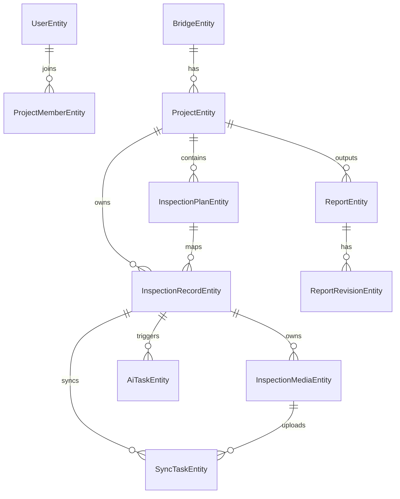

# 桥检AI（BridgeAI）安卓APP Room实体与本地数据库设计

## 1. 文档目标

本文件用于冻结安卓APP本地数据库方案，确保：

1. 安卓端页面状态有稳定的数据来源。
2. 离线作业可完整闭环。
3. 与后端接口字段一一对应。
4. 后续 Room 实现时不再因字段反复调整而返工。

---

## 2. 设计原则

1. 本地库必须能独立支撑离线检测闭环。
2. 本地实体命名尽量与后端字段语义一致，但遵循 Kotlin/Room 习惯。
3. 图片和视频不直接塞进业务表，统一使用媒体表管理。
4. 同步状态不是页面临时变量，而是数据库真实字段。
5. Room 中保留足够的本地扩展字段，用于幂等、回放、失败重试。

---

## 3. 数据库概览

数据库名称建议：

`bridge_ai.db`

MVP建议包含以下表：

1. `users`
2. `bridges`
3. `projects`
4. `project_members`
5. `inspection_plans`
6. `inspection_records`
7. `inspection_media`
8. `ai_tasks`
9. `reports`
10. `report_revisions`
11. `sync_tasks`
12. `app_configs`

---

## 4. Room实体关系图

---

## 5. 实体设计

以下为推荐的 Room 实体字段设计。

## 5.1 UserEntity

用途：

1. 保存当前登录用户及本地缓存用户信息。

字段建议：

| 字段 | 类型 | 说明 |
| --- | --- | --- |
| id | Long | 服务端用户ID |
| userCode | String | 工号 |
| username | String | 登录账号 |
| realName | String | 真实姓名 |
| role | String | admin/leader/inspector |
| company | String? | 所属公司 |
| phone | String? | 手机号 |
| avatarUrl | String? | 头像地址 |
| status | Int | 1启用，0禁用 |
| lastLoginAt | String? | 最近登录时间 |
| cachedAt | String | 本地缓存时间 |

主键建议：

1. `id`

## 5.2 BridgeEntity

字段建议：

| 字段 | 类型 | 说明 |
| --- | --- | --- |
| id | Long | 服务端桥梁ID |
| bridgeCode | String | 桥梁编码 |
| bridgeName | String | 桥梁名称 |
| route | String? | 所属路线 |
| bridgeType | String | 高速/国省干线/市政 |
| structureType | String | 结构形式 |
| totalLength | Double? | 全长 |
| bridgeWidth | Double? | 桥宽 |
| mainSpan | Double? | 主跨 |
| spanCount | Int? | 跨数 |
| constructionYear | Int | 建成年份 |
| stakeNumber | String? | 桩号 |
| centerStake | String? | 中心桩号 |
| longitude | Double? | 经度 |
| latitude | Double? | 纬度 |
| address | String? | 地址 |
| ownerUnit | String? | 业主单位 |
| maintenanceUnit | String? | 养护单位 |
| designLoad | String? | 设计荷载 |
| statusText | String? | 状态文本 |
| remarks | String? | 备注 |
| updatedAt | String | 服务端更新时间 |
| cachedAt | String | 本地缓存时间 |

## 5.3 ProjectEntity

字段建议：

| 字段 | 类型 | 说明 |
| --- | --- | --- |
| id | Long | 服务端项目ID |
| projectCode | String | 项目编号 |
| projectName | String | 项目名称 |
| bridgeId | Long | 桥梁ID |
| projectType | String | 定期/特殊/应急 |
| projectStatus | String | draft/in_progress/completed |
| leaderId | Long | 负责人 |
| startDate | String? | 开始日期 |
| endDate | String? | 结束日期 |
| description | String? | 项目说明 |
| totalComponents | Int | 总构件数，本地聚合缓存 |
| pendingComponents | Int | 未检测数 |
| collectedComponents | Int | 已采集数 |
| aiDoneComponents | Int | 已识别数 |
| completedComponents | Int | 已完成数 |
| hasUnsyncedData | Boolean | 是否存在未同步数据 |
| updatedAt | String | 服务端更新时间 |
| cachedAt | String | 本地缓存时间 |

## 5.4 ProjectMemberEntity

字段建议：

| 字段 | 类型 | 说明 |
| --- | --- | --- |
| localId | Long | 本地主键 |
| projectId | Long | 项目ID |
| userId | Long | 用户ID |
| memberRole | String | leader/inspector |
| cachedAt | String | 缓存时间 |

主键建议：

1. `localId` 自增

唯一索引建议：

1. `(projectId, userId)`

## 5.5 InspectionPlanEntity

字段建议：

| 字段 | 类型 | 说明 |
| --- | --- | --- |
| id | Long | 服务端计划ID |
| projectId | Long | 项目ID |
| componentCategory | String | 上部/下部/附属 |
| componentType | String | 构件类型 |
| componentNumber | String | 构件编号 |
| defectTypesJson | String? | 重点病害类型JSON |
| assignedInspectorId | Long? | 指派检测员 |
| planStatus | String | pending/processing/done |
| sortOrder | Int | 排序 |
| updatedAt | String | 服务端更新时间 |
| cachedAt | String | 缓存时间 |

索引建议：

1. `projectId`
2. `assignedInspectorId`
3. `(projectId, componentCategory)`

## 5.6 InspectionRecordEntity

这是最关键的本地业务表。

字段建议：

| 字段 | 类型 | 说明 |
| --- | --- | --- |
| localId | Long | Room本地主键 |
| serverId | Long? | 服务端记录ID |
| clientRecordId | String | 客户端幂等ID，必须唯一 |
| projectId | Long | 项目ID |
| planId | Long? | 计划ID |
| bridgeId | Long | 桥梁ID |
| inspectorId | Long | 检测员ID |
| componentCategory | String | 构件分类 |
| componentType | String | 构件类型 |
| componentNumber | String | 构件编号 |
| defectType | String | 病害类型 |
| defectLevel | String | 轻微/中等/严重/无病害 |
| locationDesc | String? | 位置描述 |
| sizeParamsJson | String? | 尺寸参数JSON |
| aiStatus | String | none/pending/done/failed |
| aiResultJson | String? | AI结果原始JSON |
| finalStatus | String | drafted/confirmed |
| remarks | String? | 备注 |
| longitude | Double? | 经度 |
| latitude | Double? | 纬度 |
| inspectionTime | String? | 检测时间 |
| syncStatus | String | pending/syncing/synced/failed |
| syncError | String? | 最近一次同步错误 |
| localUpdatedAt | String | 本地更新时间 |
| serverUpdatedAt | String? | 服务端更新时间 |
| createdAt | String | 本地创建时间 |

唯一索引建议：

1. `clientRecordId`

索引建议：

1. `projectId`
2. `planId`
3. `syncStatus`
4. `(projectId, componentCategory, componentType)`

## 5.7 InspectionMediaEntity

字段建议：

| 字段 | 类型 | 说明 |
| --- | --- | --- |
| localId | Long | Room本地主键 |
| serverId | Long? | 服务端媒体ID |
| clientMediaId | String | 客户端媒体ID，必须唯一 |
| recordLocalId | Long | 关联本地记录ID |
| recordServerId | Long? | 关联服务端记录ID |
| mediaType | String | photo/video |
| localPath | String | 本地文件路径 |
| remoteUrl | String? | 远端文件地址 |
| thumbnailLocalPath | String? | 本地缩略图地址 |
| thumbnailRemoteUrl | String? | 远端缩略图地址 |
| mimeType | String? | MIME类型 |
| fileSize | Long? | 文件大小 |
| width | Int? | 宽 |
| height | Int? | 高 |
| durationMs | Long? | 视频时长 |
| sortOrder | Int | 排序 |
| syncStatus | String | pending/syncing/synced/failed |
| syncError | String? | 最近同步错误 |
| createdAt | String | 创建时间 |
| updatedAt | String | 更新时间 |

唯一索引建议：

1. `clientMediaId`

索引建议：

1. `recordLocalId`
2. `syncStatus`

## 5.8 AiTaskEntity

字段建议：

| 字段 | 类型 | 说明 |
| --- | --- | --- |
| localId | Long | 本地主键 |
| serverTaskNo | String? | 服务端任务号 |
| recordLocalId | Long | 关联本地记录 |
| recordServerId | Long? | 关联服务端记录 |
| taskStatus | String | pending/running/success/failed |
| engineType | String | mock/remote/local |
| requestPayloadJson | String? | 请求快照 |
| resultPayloadJson | String? | 结果快照 |
| modelVersion | String? | 模型版本 |
| errorMessage | String? | 错误信息 |
| startedAt | String? | 开始时间 |
| finishedAt | String? | 结束时间 |
| createdAt | String | 创建时间 |

索引建议：

1. `recordLocalId`
2. `taskStatus`

## 5.9 ReportEntity

字段建议：

| 字段 | 类型 | 说明 |
| --- | --- | --- |
| localId | Long | 本地主键 |
| serverId | Long? | 服务端报告ID |
| reportCode | String? | 报告编号 |
| projectId | Long | 项目ID |
| bridgeId | Long | 桥梁ID |
| reportStatus | String | draft/completed/reported |
| reportContentJson | String | 报告完整JSON |
| technicalRatingJson | String? | 技术状况评定 |
| maintenanceAdviceJson | String? | 养护建议 |
| signersJson | String? | 签字信息 |
| pdfLocalPath | String? | 本地PDF路径 |
| pdfRemoteUrl | String? | 远端PDF地址 |
| syncStatus | String | pending/syncing/synced/failed |
| syncError | String? | 同步错误 |
| localUpdatedAt | String | 本地更新时间 |
| serverUpdatedAt | String? | 服务端更新时间 |
| createdAt | String | 创建时间 |

索引建议：

1. `projectId`
2. `reportStatus`
3. `syncStatus`

## 5.10 ReportRevisionEntity

字段建议：

| 字段 | 类型 | 说明 |
| --- | --- | --- |
| localId | Long | 本地主键 |
| serverId | Long? | 服务端历史ID |
| reportLocalId | Long | 关联本地报告 |
| reportServerId | Long? | 关联服务端报告 |
| editorId | Long | 编辑人 |
| revisionType | String | remark/advice/signer/status |
| beforeJson | String? | 修改前 |
| afterJson | String? | 修改后 |
| syncStatus | String | pending/syncing/synced/failed |
| createdAt | String | 创建时间 |

## 5.11 SyncTaskEntity

这是离线同步核心表。

字段建议：

| 字段 | 类型 | 说明 |
| --- | --- | --- |
| localId | Long | 本地主键 |
| taskType | String | upload_record/upload_media/update_report/fetch_ai_result |
| bizLocalId | Long? | 业务本地ID |
| bizServerId | Long? | 业务服务端ID |
| bizKey | String? | 业务唯一标识，如clientRecordId |
| payloadJson | String? | 任务参数快照 |
| taskStatus | String | pending/running/success/failed |
| retryCount | Int | 已重试次数 |
| maxRetryCount | Int | 最大重试次数 |
| lastError | String? | 最近错误 |
| nextRetryAt | String? | 下次重试时间 |
| createdAt | String | 创建时间 |
| updatedAt | String | 更新时间 |

索引建议：

1. `taskStatus`
2. `taskType`
3. `bizKey`
4. `nextRetryAt`

## 5.12 AppConfigEntity

用于轻量配置。

字段建议：

| 字段 | 类型 | 说明 |
| --- | --- | --- |
| configKey | String | 配置键，主键 |
| configValue | String | 配置值 |
| updatedAt | String | 更新时间 |

建议用途：

1. 当前登录用户ID
2. 最后同步时间
3. 当前接口环境
4. 当前模型版本

---

## 6. Room 关系封装建议

## 6.1 建议的组合对象

建议在 DAO 之外增加以下组合模型：

1. `ProjectWithBridge`
2. `ProjectWithMembers`
3. `PlanWithLatestRecord`
4. `RecordWithMedia`
5. `ReportWithRevisions`

这样可以避免页面层频繁手动拼接多张表。

## 6.2 页面与本地实体映射建议

| 页面 | 主要数据源 |
| --- | --- |
| 任务列表页 | ProjectEntity + BridgeEntity |
| 项目检测页 | ProjectEntity + InspectionPlanEntity + InspectionRecordEntity |
| 构件采集页 | InspectionPlanEntity + InspectionMediaEntity |
| 构件结果页 | InspectionRecordEntity + InspectionMediaEntity + AiTaskEntity |
| 报告列表页 | ReportEntity + BridgeEntity |
| 数据同步页 | SyncTaskEntity + InspectionRecordEntity + InspectionMediaEntity |

---

## 7. DAO 拆分建议

建议按业务拆分 DAO，而不是全部塞进一个数据库访问对象。

建议：

1. `UserDao`
2. `BridgeDao`
3. `ProjectDao`
4. `ProjectMemberDao`
5. `InspectionPlanDao`
6. `InspectionRecordDao`
7. `InspectionMediaDao`
8. `AiTaskDao`
9. `ReportDao`
10. `ReportRevisionDao`
11. `SyncTaskDao`
12. `AppConfigDao`

---

## 8. 关键查询建议

## 8.1 任务列表

需要支持：

1. 按当前用户过滤项目
2. 按状态过滤项目
3. 按是否存在未同步数据排序

## 8.2 项目检测页

需要支持：

1. 查询项目下全部计划
2. 查询每个计划对应最新检测记录
3. 统计构件状态数量

## 8.3 构件结果页

需要支持：

1. 按构件获取最新检测记录
2. 获取该记录全部媒体
3. 获取该记录最近AI任务

## 8.4 同步页

需要支持：

1. 查询全部失败或待同步任务
2. 按任务类型分组统计
3. 联表看到关联记录标题信息

---

## 9. 实体状态规范

## 9.1 syncStatus 通用枚举

建议统一使用：

1. `pending`
2. `syncing`
3. `synced`
4. `failed`

## 9.2 finalStatus 枚举

1. `drafted`
2. `confirmed`

## 9.3 记录缺陷等级枚举

1. `轻微`
2. `中等`
3. `严重`
4. `无病害`

---

## 10. 迁移策略建议

Room 版本升级建议：

1. 所有版本升级都写 Migration，不依赖 destructive migration。
2. 图片、视频、报告等历史数据一旦写入，不允许因升级直接清空。
3. 初期版本允许字段冗余，优先保证可迁移。

建议从 `version = 1` 起即建立 migration 纪律。

---

## 11. 编码建议

## 11.1 命名建议

1. Room 实体统一使用 `Entity` 后缀
2. 数据传输模型统一使用 `Dto`
3. 页面UI模型统一使用 `UiModel`
4. 不直接在页面层操作 Entity

## 11.2 JSON字段处理建议

以下字段使用 `TypeConverter`：

1. `defectTypesJson`
2. `sizeParamsJson`
3. `aiResultJson`
4. `reportContentJson`
5. `technicalRatingJson`
6. `maintenanceAdviceJson`
7. `signersJson`

## 11.3 时间建议

1. 本地统一保存 ISO 8601 字符串
2. 页面层再转换为展示格式

---

## 12. 开始编码前必须锁定的本地数据结论

以下结论建议直接冻结，不再反复讨论：

1. 检测记录和媒体必须拆表。
2. `clientRecordId` 与 `clientMediaId` 必须存在。
3. `syncStatus` 必须落库。
4. AI任务必须单独建表，不挂成页面临时状态。
5. 报告内容用 JSON 存储，预览和 PDF 共用同一结构。

---

## 13. 本文结论

桥检AI安卓端本地数据库的重点不是“表越少越简单”，而是：

`是否能让离线检测、媒体管理、AI状态、同步重试和报告生成都拥有稳定的数据承载。`

只要这层设计锁住，后续安卓端正式开写时就会稳很多。
