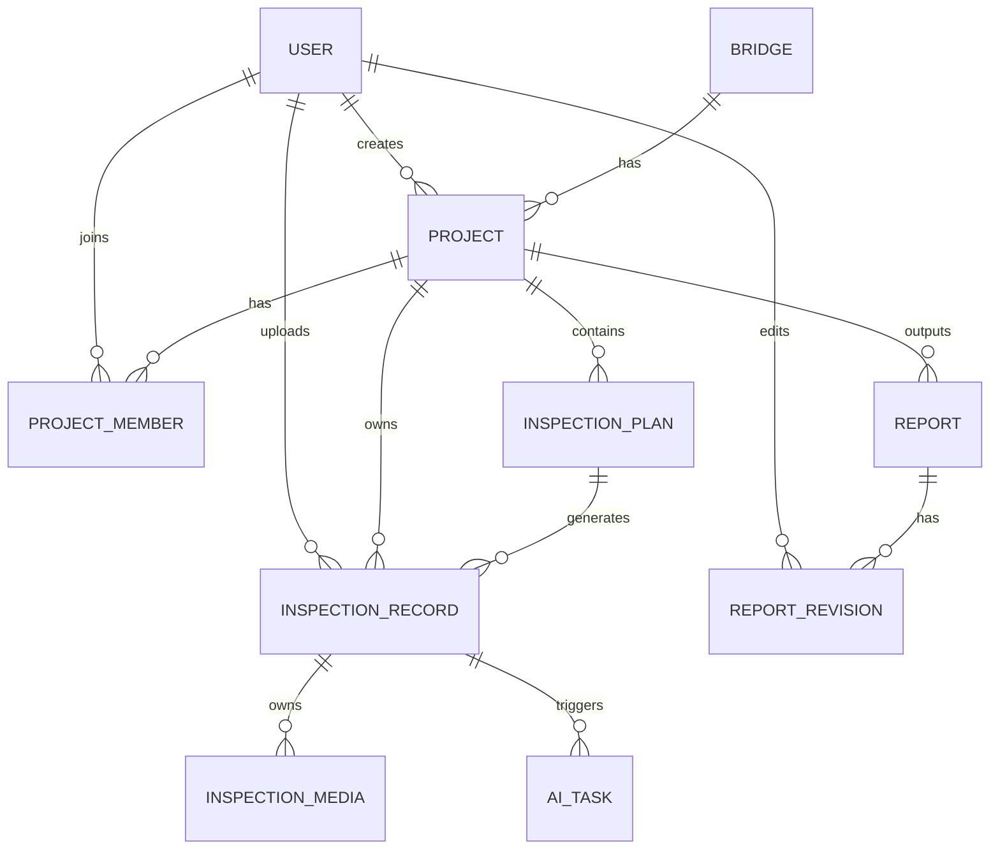

# 桥检AI（BridgeAI）安卓APP 后端API清单与数据库设计

## 1. 文档目标

本文件用于定义桥检AI安卓APP MVP阶段的后端数据与接口基线，作为以下角色的统一联调依据：

1. 安卓开发
2. 后端开发
3. 测试
4. 产品

本文件回答4个问题：

1. 后端最小需要管理哪些核心实体。
2. 数据库表之间是什么关系。
3. MVP阶段需要提供哪些API。
4. 每个API的请求与响应字段如何约定。

---

## 2. 设计原则

1. 以后端数据模型驱动业务，而不是按页面临时拼接口。
2. 安卓APP优先，接口需适配弱网、断点、重试、离线同步。
3. 先满足MVP闭环，不预先做复杂平台化抽象。
4. 所有检测数据都要可追溯到 `桥梁 -> 项目 -> 构件 -> 检测记录 -> 媒体 -> 报告`。
5. AI识别结果是建议值，人工校核后的结果才是业务最终值。

---

## 3. MVP后端能力范围

## 3.1 必须支持

1. 用户登录与用户信息获取
2. 桥梁档案管理
3. 检测项目管理
4. 构件级检测计划管理
5. 检测记录上传与查询
6. 媒体文件上传
7. AI识别任务提交与结果获取
8. 报告生成、查询、编辑、导出、上报

## 3.2 暂不支持

1. 复杂组织架构
2. 多租户平台能力
3. 通用工作流引擎
4. 无人机实时流接口
5. BI分析大屏接口
6. 第三方系统对接

---

## 4. 核心实体说明

| 实体 | 说明 |
| --- | --- |
| user | 用户 |
| bridge | 桥梁档案 |
| project | 检测项目 |
| project_member | 项目成员 |
| inspection_plan | 构件检测计划 |
| inspection_record | 构件检测记录 |
| inspection_media | 检测媒体文件 |
| ai_task | AI识别任务 |
| report | 检测报告 |
| report_revision | 报告修改记录 |

---

## 5. 数据库ER图



---

## 6. 表结构设计

说明：

1. 以下为MVP阶段推荐结构。
2. 字段类型以 MySQL 8.x 为参考。
3. 通用字段如 `created_at`、`updated_at`、`deleted_at` 默认不再逐表重复解释。

## 6.1 user

### 表说明

保存登录用户与角色信息。

### 字段

| 字段名 | 类型 | 说明 | 约束 |
| --- | --- | --- | --- |
| id | bigint | 主键 | PK |
| user_code | varchar(64) | 工号 | unique, not null |
| username | varchar(64) | 登录账号 | unique, not null |
| password_hash | varchar(255) | 密码摘要 | not null |
| real_name | varchar(64) | 真实姓名 | not null |
| role | varchar(32) | 角色：inspector/leader/admin | not null |
| company | varchar(128) | 所属单位 | null |
| phone | varchar(32) | 手机号 | null |
| avatar_url | varchar(255) | 头像地址 | null |
| status | tinyint | 状态：1启用，0禁用 | default 1 |
| last_login_at | datetime | 最近登录时间 | null |
| created_at | datetime | 创建时间 | not null |
| updated_at | datetime | 更新时间 | not null |

## 6.2 bridge

### 表说明

桥梁基础档案。

### 字段

| 字段名 | 类型 | 说明 | 约束 |
| --- | --- | --- | --- |
| id | bigint | 主键 | PK |
| bridge_code | varchar(64) | 桥梁编码 | unique, not null |
| bridge_name | varchar(128) | 桥梁名称 | not null |
| route | varchar(128) | 所属路线 | null |
| bridge_type | varchar(32) | 高速公路/国省干线/市政桥梁 | not null |
| structure_type | varchar(64) | 结构形式 | not null |
| total_length | decimal(10,2) | 全长米数 | null |
| bridge_width | decimal(10,2) | 桥宽米数 | null |
| main_span | decimal(10,2) | 主跨米数 | null |
| span_count | int | 跨数 | null |
| construction_year | int | 建成年份 | not null |
| stake_number | varchar(64) | 桩号 | null |
| center_stake | varchar(64) | 中心桩号 | null |
| longitude | decimal(12,8) | 经度 | null |
| latitude | decimal(12,8) | 纬度 | null |
| address | varchar(255) | 地址描述 | null |
| owner_unit | varchar(128) | 业主单位 | null |
| maintenance_unit | varchar(128) | 养护单位 | null |
| design_load | varchar(64) | 设计荷载 | null |
| status | varchar(32) | 桥梁状态 | null |
| remarks | text | 备注 | null |
| created_by | bigint | 创建人 | not null |
| created_at | datetime | 创建时间 | not null |
| updated_at | datetime | 更新时间 | not null |

## 6.3 project

### 表说明

桥梁检测项目，按一次检测任务聚合。

### 字段

| 字段名 | 类型 | 说明 | 约束 |
| --- | --- | --- | --- |
| id | bigint | 主键 | PK |
| project_code | varchar(64) | 项目编号 | unique, not null |
| project_name | varchar(128) | 项目名称 | not null |
| bridge_id | bigint | 关联桥梁ID | not null |
| project_type | varchar(32) | 定期检测/特殊检测/应急检测 | not null |
| project_status | varchar(32) | draft/in_progress/completed | not null |
| leader_id | bigint | 项目负责人 | not null |
| start_date | date | 开始日期 | null |
| end_date | date | 结束日期 | null |
| description | text | 项目说明 | null |
| created_by | bigint | 创建人 | not null |
| created_at | datetime | 创建时间 | not null |
| updated_at | datetime | 更新时间 | not null |

## 6.4 project_member

### 表说明

项目和成员的关联表。

### 字段

| 字段名 | 类型 | 说明 | 约束 |
| --- | --- | --- | --- |
| id | bigint | 主键 | PK |
| project_id | bigint | 项目ID | not null |
| user_id | bigint | 用户ID | not null |
| member_role | varchar(32) | leader/inspector | not null |
| created_at | datetime | 创建时间 | not null |

唯一索引建议：

1. `(project_id, user_id)`

## 6.5 inspection_plan

### 表说明

项目中的构件级检测计划。

### 字段

| 字段名 | 类型 | 说明 | 约束 |
| --- | --- | --- | --- |
| id | bigint | 主键 | PK |
| project_id | bigint | 项目ID | not null |
| component_category | varchar(32) | 上部结构/下部结构/附属设施 | not null |
| component_type | varchar(64) | 构件类型 | not null |
| component_number | varchar(64) | 构件编号 | not null |
| defect_types_json | json | 重点病害类型列表 | null |
| assigned_inspector_id | bigint | 指派检测员 | null |
| plan_status | varchar(32) | pending/processing/done | not null |
| sort_order | int | 排序 | default 0 |
| created_at | datetime | 创建时间 | not null |
| updated_at | datetime | 更新时间 | not null |

索引建议：

1. `(project_id, component_category)`
2. `(project_id, assigned_inspector_id)`

## 6.6 inspection_record

### 表说明

一次针对具体构件的正式检测记录。该表保存人工确认后的结构化结果。

### 字段

| 字段名 | 类型 | 说明 | 约束 |
| --- | --- | --- | --- |
| id | bigint | 主键 | PK |
| project_id | bigint | 项目ID | not null |
| plan_id | bigint | 计划ID | null |
| bridge_id | bigint | 桥梁ID | not null |
| inspector_id | bigint | 检测员ID | not null |
| component_category | varchar(32) | 构件分类 | not null |
| component_type | varchar(64) | 构件类型 | not null |
| component_number | varchar(64) | 构件编号 | not null |
| defect_type | varchar(64) | 病害类型 | not null |
| defect_level | varchar(32) | 轻微/中等/严重/无病害 | not null |
| location_desc | varchar(255) | 位置描述 | null |
| size_params_json | json | 尺寸参数 | null |
| ai_status | varchar(32) | none/pending/done/failed | not null |
| ai_result_json | json | AI原始识别结果快照 | null |
| final_status | varchar(32) | drafted/confirmed | not null |
| remarks | text | 备注 | null |
| longitude | decimal(12,8) | 经度 | null |
| latitude | decimal(12,8) | 纬度 | null |
| inspection_time | datetime | 检测时间 | null |
| client_record_id | varchar(64) | 客户端本地记录ID | null |
| sync_status | varchar(32) | pending/synced/failed | not null |
| created_at | datetime | 创建时间 | not null |
| updated_at | datetime | 更新时间 | not null |

索引建议：

1. `(project_id, component_category, component_type)`
2. `(project_id, inspector_id)`
3. `(plan_id)`
4. `(client_record_id)`

## 6.7 inspection_media

### 表说明

检测记录对应的媒体文件。

### 字段

| 字段名 | 类型 | 说明 | 约束 |
| --- | --- | --- | --- |
| id | bigint | 主键 | PK |
| record_id | bigint | 检测记录ID | not null |
| media_type | varchar(16) | photo/video | not null |
| file_name | varchar(255) | 文件名 | not null |
| file_url | varchar(255) | 远端访问地址 | not null |
| thumbnail_url | varchar(255) | 缩略图地址 | null |
| file_size | bigint | 文件大小字节 | null |
| mime_type | varchar(64) | 文件MIME | null |
| width | int | 宽度 | null |
| height | int | 高度 | null |
| duration_ms | int | 视频时长毫秒 | null |
| sort_order | int | 排序 | default 0 |
| created_at | datetime | 创建时间 | not null |

索引建议：

1. `(record_id, media_type)`

## 6.8 ai_task

### 表说明

记录一次AI识别任务，便于异步识别和结果追溯。

### 字段

| 字段名 | 类型 | 说明 | 约束 |
| --- | --- | --- | --- |
| id | bigint | 主键 | PK |
| record_id | bigint | 检测记录ID | not null |
| task_no | varchar(64) | AI任务号 | unique, not null |
| task_status | varchar(32) | pending/running/success/failed | not null |
| engine_type | varchar(32) | mock/remote/local | not null |
| request_payload_json | json | 请求快照 | null |
| result_payload_json | json | 结果快照 | null |
| model_version | varchar(64) | 模型版本 | null |
| error_message | varchar(255) | 错误信息 | null |
| started_at | datetime | 开始时间 | null |
| finished_at | datetime | 结束时间 | null |
| created_at | datetime | 创建时间 | not null |

## 6.9 report

### 表说明

项目级报告。

### 字段

| 字段名 | 类型 | 说明 | 约束 |
| --- | --- | --- | --- |
| id | bigint | 主键 | PK |
| report_code | varchar(64) | 报告编号 | unique, not null |
| project_id | bigint | 项目ID | not null |
| bridge_id | bigint | 桥梁ID | not null |
| report_status | varchar(32) | draft/completed/reported | not null |
| report_content_json | json | 报告结构化内容 | not null |
| technical_rating_json | json | 技术状况评定 | null |
| maintenance_advice_json | json | 养护建议 | null |
| signers_json | json | 签字信息 | null |
| pdf_url | varchar(255) | PDF地址 | null |
| reported_at | datetime | 上报时间 | null |
| created_by | bigint | 生成人 | not null |
| created_at | datetime | 创建时间 | not null |
| updated_at | datetime | 更新时间 | not null |

## 6.10 report_revision

### 表说明

记录报告的编辑历史。

### 字段

| 字段名 | 类型 | 说明 | 约束 |
| --- | --- | --- | --- |
| id | bigint | 主键 | PK |
| report_id | bigint | 报告ID | not null |
| editor_id | bigint | 编辑人 | not null |
| revision_type | varchar(32) | remark/advice/signer/status | not null |
| before_json | json | 修改前快照 | null |
| after_json | json | 修改后快照 | null |
| created_at | datetime | 创建时间 | not null |

---

## 7. 统一接口规范

## 7.1 Base URL

建议：

`/api/v1`

## 7.2 认证方式

1. 登录接口返回 `access_token` 与 `refresh_token`
2. 业务接口使用 `Authorization: Bearer <token>`

## 7.3 通用响应格式

```json
{
  "code": 0,
  "message": "success",
  "data": {},
  "request_id": "7d3a3d6d7e9f4a56a3b1",
  "server_time": "2026-04-16T20:10:00+08:00"
}
```

说明：

1. `code=0` 表示成功
2. 非0表示业务失败
3. 所有接口都返回 `request_id` 便于排查

## 7.4 分页格式

```json
{
  "list": [],
  "page": 1,
  "page_size": 20,
  "total": 135
}
```

## 7.5 时间格式

统一使用：

`ISO 8601`，例如 `2026-04-16T20:10:00+08:00`

## 7.6 主要业务状态枚举

### 用户角色

1. `admin`
2. `leader`
3. `inspector`

### 项目状态

1. `draft`
2. `in_progress`
3. `completed`

### 构件计划状态

1. `pending`
2. `processing`
3. `done`

### 检测记录AI状态

1. `none`
2. `pending`
3. `done`
4. `failed`

### 检测记录同步状态

1. `pending`
2. `synced`
3. `failed`

### 报告状态

1. `draft`
2. `completed`
3. `reported`

---

## 8. API清单总览

| 模块 | 接口数量 | 说明 |
| --- | --- | --- |
| 认证 | 3 | 登录、刷新、用户信息 |
| 桥梁 | 5 | 列表、详情、创建、更新 |
| 项目 | 7 | 列表、详情、创建、成员、进度 |
| 检测计划 | 4 | 查询、保存、更新状态 |
| 检测记录 | 7 | 创建、更新、详情、列表、完成 |
| 媒体 | 2 | 上传、删除 |
| AI识别 | 3 | 提交、查询、批量提交 |
| 报告 | 7 | 列表、详情、生成、编辑、导出、上报 |

---

## 9. 认证模块API

## 9.1 登录

### 接口

`POST /api/v1/auth/login`

### 请求体

```json
{
  "username": "zhangsan",
  "password": "123456"
}
```

### 响应体

```json
{
  "code": 0,
  "message": "success",
  "data": {
    "access_token": "xxx",
    "refresh_token": "yyy",
    "expires_in": 7200,
    "user": {
      "id": 1,
      "user_code": "2024001",
      "username": "zhangsan",
      "real_name": "张三",
      "role": "inspector",
      "company": "XX交通养护公司"
    }
  }
}
```

## 9.2 刷新Token

### 接口

`POST /api/v1/auth/refresh`

### 请求体

```json
{
  "refresh_token": "yyy"
}
```

## 9.3 获取当前用户信息

### 接口

`GET /api/v1/auth/me`

---

## 10. 桥梁模块API

## 10.1 桥梁列表

### 接口

`GET /api/v1/bridges`

### 查询参数

| 参数 | 类型 | 说明 |
| --- | --- | --- |
| keyword | string | 名称或编码搜索 |
| bridge_type | string | 桥梁类型筛选 |
| page | int | 页码 |
| page_size | int | 每页数量 |

### 响应data

```json
{
  "list": [
    {
      "id": 101,
      "bridge_code": "G105-001",
      "bridge_name": "长江大桥",
      "bridge_type": "国省干线",
      "structure_type": "斜拉桥",
      "construction_year": 2005,
      "latest_project_status": "in_progress"
    }
  ],
  "page": 1,
  "page_size": 20,
  "total": 1
}
```

## 10.2 桥梁详情

### 接口

`GET /api/v1/bridges/{bridge_id}`

### 响应data

包含 `bridge` 基本信息、历史项目摘要、最近报告摘要。

## 10.3 创建桥梁

### 接口

`POST /api/v1/bridges`

### 请求体

```json
{
  "bridge_code": "G105-001",
  "bridge_name": "长江大桥",
  "route": "G105国道",
  "bridge_type": "国省干线",
  "structure_type": "斜拉桥",
  "construction_year": 2005,
  "total_length": 900,
  "bridge_width": 32,
  "main_span": 500,
  "address": "XX省XX市XX路",
  "maintenance_unit": "XX交通养护公司",
  "remarks": ""
}
```

## 10.4 更新桥梁

### 接口

`PUT /api/v1/bridges/{bridge_id}`

## 10.5 桥梁历史项目

### 接口

`GET /api/v1/bridges/{bridge_id}/projects`

---

## 11. 项目模块API

## 11.1 项目列表

### 接口

`GET /api/v1/projects`

### 查询参数

| 参数 | 类型 | 说明 |
| --- | --- | --- |
| status | string | draft/in_progress/completed |
| mine_only | int | 1表示仅我的项目 |
| page | int | 页码 |
| page_size | int | 每页数量 |

## 11.2 项目详情

### 接口

`GET /api/v1/projects/{project_id}`

### 响应data重点字段

```json
{
  "id": 201,
  "project_code": "PRJ-202604-001",
  "project_name": "长江大桥2026年定期检测",
  "project_type": "定期检测",
  "project_status": "in_progress",
  "bridge": {
    "id": 101,
    "bridge_name": "长江大桥",
    "bridge_code": "G105-001"
  },
  "leader": {
    "id": 10,
    "real_name": "王工"
  },
  "members": [
    {
      "id": 1,
      "real_name": "张三",
      "role": "inspector"
    }
  ]
}
```

## 11.3 创建项目

### 接口

`POST /api/v1/projects`

### 请求体

```json
{
  "project_name": "长江大桥2026年定期检测",
  "bridge_id": 101,
  "project_type": "定期检测",
  "leader_id": 10,
  "member_ids": [1, 2, 3],
  "start_date": "2026-04-20",
  "end_date": "2026-04-25",
  "description": "全桥定期检测"
}
```

## 11.4 更新项目

### 接口

`PUT /api/v1/projects/{project_id}`

## 11.5 项目成员列表

### 接口

`GET /api/v1/projects/{project_id}/members`

## 11.6 更新项目成员

### 接口

`PUT /api/v1/projects/{project_id}/members`

### 请求体

```json
{
  "leader_id": 10,
  "member_ids": [1, 2, 3]
}
```

## 11.7 项目进度

### 接口

`GET /api/v1/projects/{project_id}/progress`

### 响应data

```json
{
  "total_components": 28,
  "pending_components": 10,
  "collected_components": 8,
  "ai_done_components": 5,
  "completed_components": 5
}
```

---

## 12. 检测计划模块API

## 12.1 获取项目检测计划

### 接口

`GET /api/v1/projects/{project_id}/plans`

### 响应data

```json
{
  "list": [
    {
      "id": 3001,
      "component_category": "上部结构",
      "component_type": "主梁",
      "component_number": "左幅1跨",
      "defect_types": ["裂缝", "剥落", "渗水/潮湿"],
      "assigned_inspector_id": 1,
      "plan_status": "processing"
    }
  ]
}
```

## 12.2 批量保存检测计划

### 接口

`PUT /api/v1/projects/{project_id}/plans`

### 请求体

```json
{
  "plans": [
    {
      "id": 3001,
      "component_category": "上部结构",
      "component_type": "主梁",
      "component_number": "左幅1跨",
      "defect_types": ["裂缝", "剥落"],
      "assigned_inspector_id": 1,
      "sort_order": 1
    },
    {
      "component_category": "下部结构",
      "component_type": "桥墩",
      "component_number": "1#墩",
      "defect_types": ["裂缝", "渗水/潮湿"],
      "assigned_inspector_id": 2,
      "sort_order": 2
    }
  ]
}
```

## 12.3 更新单个计划状态

### 接口

`PATCH /api/v1/plans/{plan_id}/status`

### 请求体

```json
{
  "plan_status": "done"
}
```

## 12.4 获取我的构件计划

### 接口

`GET /api/v1/my/plans`

---

## 13. 检测记录模块API

## 13.1 创建检测记录

### 接口

`POST /api/v1/inspection-records`

### 请求体

```json
{
  "project_id": 201,
  "plan_id": 3001,
  "bridge_id": 101,
  "inspector_id": 1,
  "component_category": "上部结构",
  "component_type": "主梁",
  "component_number": "左幅1跨",
  "defect_type": "裂缝",
  "defect_level": "中等",
  "location_desc": "梁底距墩2m",
  "size_params": {
    "length_cm": 120,
    "width_mm": 0.3
  },
  "remarks": "",
  "longitude": 118.12345678,
  "latitude": 32.12345678,
  "inspection_time": "2026-04-16T10:20:30+08:00",
  "client_record_id": "local-rec-001"
}
```

### 响应data

```json
{
  "id": 5001,
  "record_no": "REC-20260416-0001"
}
```

## 13.2 更新检测记录

### 接口

`PUT /api/v1/inspection-records/{record_id}`

说明：

1. 用于人工校核后的结果覆盖。
2. 后端应保留 `ai_result_json` 原始快照，不被覆盖。

## 13.3 检测记录详情

### 接口

`GET /api/v1/inspection-records/{record_id}`

### 响应data

返回：

1. 记录主体
2. 媒体列表
3. AI状态
4. AI结果

## 13.4 按项目查询检测记录

### 接口

`GET /api/v1/projects/{project_id}/inspection-records`

### 查询参数

| 参数 | 类型 | 说明 |
| --- | --- | --- |
| component_category | string | 构件分类 |
| assigned_to_me | int | 是否仅看自己 |
| page | int | 页码 |
| page_size | int | 每页数量 |

## 13.5 标记检测记录完成

### 接口

`PATCH /api/v1/inspection-records/{record_id}/confirm`

### 请求体

```json
{
  "final_status": "confirmed"
}
```

## 13.6 批量查询待同步记录

### 接口

`POST /api/v1/inspection-records/sync-check`

用途：

1. 客户端回网后批量核对本地记录是否已存在于服务端。

### 请求体

```json
{
  "client_record_ids": ["local-rec-001", "local-rec-002"]
}
```

## 13.7 删除检测记录

### 接口

`DELETE /api/v1/inspection-records/{record_id}`

说明：

1. MVP建议谨慎开放，仅限未进入正式报告的数据删除。

---

## 14. 媒体模块API

## 14.1 上传媒体

### 接口

`POST /api/v1/inspection-records/{record_id}/media`

### 请求类型

`multipart/form-data`

### 表单字段

| 字段 | 类型 | 说明 |
| --- | --- | --- |
| file | binary | 媒体文件 |
| media_type | string | photo/video |
| sort_order | int | 排序 |
| client_media_id | string | 客户端本地媒体ID |

### 响应data

```json
{
  "id": 8001,
  "file_url": "https://cdn.example.com/xxx.jpg",
  "thumbnail_url": "https://cdn.example.com/thumb_xxx.jpg"
}
```

## 14.2 删除媒体

### 接口

`DELETE /api/v1/inspection-media/{media_id}`

---

## 15. AI识别模块API

## 15.1 提交识别任务

### 接口

`POST /api/v1/ai/tasks`

### 请求体

```json
{
  "record_id": 5001,
  "media_ids": [8001, 8002],
  "engine_type": "remote"
}
```

### 响应data

```json
{
  "task_no": "AI-20260416-0001",
  "task_status": "pending"
}
```

## 15.2 查询识别任务结果

### 接口

`GET /api/v1/ai/tasks/{task_no}`

### 响应data

```json
{
  "task_no": "AI-20260416-0001",
  "task_status": "success",
  "model_version": "yolo-v1.0.0",
  "result": {
    "defects": [
      {
        "defect_type": "裂缝",
        "confidence": 0.95,
        "bbox": [100, 120, 280, 160],
        "level": "中等",
        "size_params": {
          "length_cm": 120,
          "width_mm": 0.3
        }
      }
    ]
  }
}
```

## 15.3 批量提交项目待识别构件

### 接口

`POST /api/v1/projects/{project_id}/ai/batch`

### 请求体

```json
{
  "record_ids": [5001, 5002, 5003]
}
```

---

## 16. 报告模块API

## 16.1 报告列表

### 接口

`GET /api/v1/reports`

### 查询参数

| 参数 | 类型 | 说明 |
| --- | --- | --- |
| keyword | string | 报告名或桥梁名 |
| status | string | draft/completed/reported |
| page | int | 页码 |
| page_size | int | 每页数量 |

## 16.2 报告详情

### 接口

`GET /api/v1/reports/{report_id}`

### 响应data

```json
{
  "id": 9001,
  "report_code": "REP-20260416-0001",
  "project_id": 201,
  "bridge_id": 101,
  "report_status": "draft",
  "report_content": {
    "project_info": {},
    "bridge_info": {},
    "inspection_overview": {},
    "defect_summary": {},
    "defect_list": [],
    "technical_rating": {},
    "maintenance_advice": {}
  },
  "pdf_url": null,
  "updated_at": "2026-04-16T20:20:00+08:00"
}
```

## 16.3 生成报告

### 接口

`POST /api/v1/projects/{project_id}/reports/generate`

### 请求体

```json
{
  "generated_by": 10
}
```

### 返回

1. 若同步生成，直接返回报告详情。
2. 若异步生成，返回任务状态与轮询地址。

MVP建议：

1. 先采用同步生成。

## 16.4 编辑报告

### 接口

`PUT /api/v1/reports/{report_id}`

### 请求体

```json
{
  "maintenance_advice": {
    "routine": [
      "建议30日内进行裂缝封闭处理"
    ]
  },
  "signers": {
    "leader": "王工",
    "inspectors": ["张三", "李四"]
  },
  "remarks": "已完成人工复核"
}
```

说明：

1. 后端仅允许修改白名单字段。

## 16.5 确认报告完成

### 接口

`PATCH /api/v1/reports/{report_id}/complete`

## 16.6 导出PDF

### 接口

`POST /api/v1/reports/{report_id}/export-pdf`

### 响应data

```json
{
  "pdf_url": "https://cdn.example.com/report/REP-20260416-0001.pdf"
}
```

## 16.7 上报报告

### 接口

`PATCH /api/v1/reports/{report_id}/report`

### 请求体

```json
{
  "reported_by": 10,
  "report_note": "请审阅本次定期检测报告"
}
```

---

## 17. 客户端重点数据结构示例

## 17.1 inspection_record 返回对象

```json
{
  "id": 5001,
  "project_id": 201,
  "plan_id": 3001,
  "bridge_id": 101,
  "inspector_id": 1,
  "component_category": "上部结构",
  "component_type": "主梁",
  "component_number": "左幅1跨",
  "defect_type": "裂缝",
  "defect_level": "中等",
  "location_desc": "梁底距墩2m",
  "size_params": {
    "length_cm": 120,
    "width_mm": 0.3
  },
  "ai_status": "done",
  "final_status": "confirmed",
  "remarks": "",
  "media_list": [
    {
      "id": 8001,
      "media_type": "photo",
      "file_url": "https://cdn.example.com/1.jpg",
      "thumbnail_url": "https://cdn.example.com/t1.jpg"
    }
  ]
}
```

## 17.2 report_content JSON 示例

```json
{
  "project_info": {
    "project_name": "长江大桥2026年定期检测",
    "inspection_type": "定期检测",
    "leader": "王工",
    "inspectors": ["张三", "李四", "王五"]
  },
  "bridge_info": {
    "bridge_name": "长江大桥",
    "bridge_code": "G105-001",
    "structure_type": "斜拉桥"
  },
  "inspection_overview": {
    "inspection_date": "2026-04-16",
    "method": "人工检测 + AI辅助识别"
  },
  "defect_summary": {
    "total_defects": 15,
    "by_level": {
      "轻微": 8,
      "中等": 6,
      "严重": 1
    }
  },
  "defect_list": [
    {
      "component_category": "上部结构",
      "component_type": "主梁",
      "component_number": "左幅1跨",
      "defect_type": "裂缝",
      "location_desc": "梁底距墩2m",
      "size_params": {
        "length_cm": 120,
        "width_mm": 0.3
      },
      "level": "中等",
      "photos": [
        "https://cdn.example.com/1.jpg"
      ]
    }
  ],
  "technical_rating": {
    "upper_structure": 92,
    "lower_structure": 88,
    "deck_system": 95,
    "overall": 2
  },
  "maintenance_advice": {
    "routine": [
      "建议30日内进行裂缝封闭处理"
    ]
  }
}
```

---

## 18. 错误码建议

| code | 含义 | 说明 |
| --- | --- | --- |
| 0 | success | 成功 |
| 10001 | unauthorized | 未登录或token失效 |
| 10002 | forbidden | 无权限 |
| 10003 | invalid_param | 参数错误 |
| 10004 | not_found | 资源不存在 |
| 10005 | conflict | 状态冲突 |
| 10006 | duplicate | 重复提交 |
| 20001 | upload_failed | 文件上传失败 |
| 20002 | ai_failed | AI识别失败 |
| 20003 | report_generate_failed | 报告生成失败 |
| 30001 | internal_error | 服务端异常 |

---

## 19. 联调优先级建议

为了尽快支撑安卓端开发，后端接口建议按以下顺序交付：

### 第一批

1. `auth/login`
2. `auth/me`
3. `bridges list/detail/create/update`
4. `projects list/detail/create`
5. `plans get/put`

### 第二批

1. `inspection-records create/update/detail/list`
2. `media upload/delete`
3. `projects progress`

### 第三批

1. `ai tasks create/query/batch`
2. `reports generate/detail/list/edit`
3. `reports export-pdf/report`

---

## 20. 对安卓联调最重要的字段

如果只能先冻结一批字段，我建议优先冻结这12类：

1. 用户ID与角色
2. bridge_id
3. project_id
4. plan_id
5. component_category
6. component_type
7. component_number
8. defect_type
9. defect_level
10. ai_status
11. report_status
12. client_record_id

原因：

这些字段一旦反复变，会直接影响：

1. 页面状态判断
2. 本地数据库结构
3. 同步幂等
4. 报告生成逻辑

---

## 21. 本文结论

桥检AI后端在MVP阶段最重要的不是做“很多接口”，而是做“稳定且口径统一的少量核心接口”。

判断后端设计是否正确，只看一个标准：

`安卓端能否基于这些API，把桥梁、项目、构件、检测记录、媒体、报告稳定串成一条完整交付链。`
