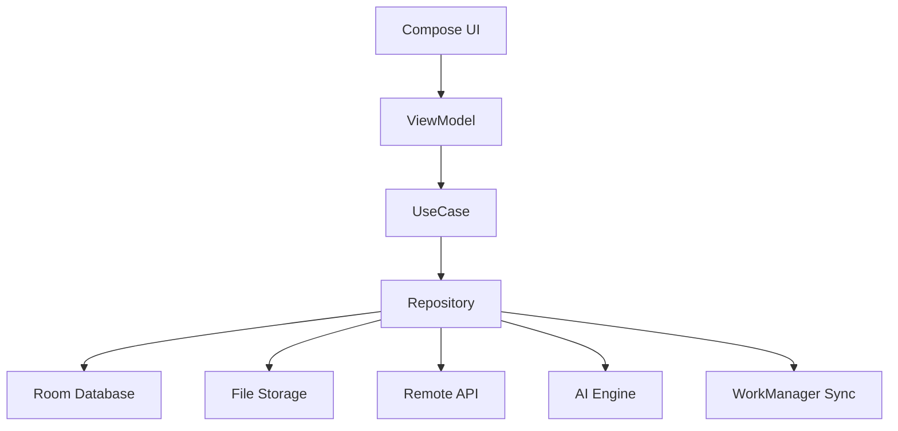
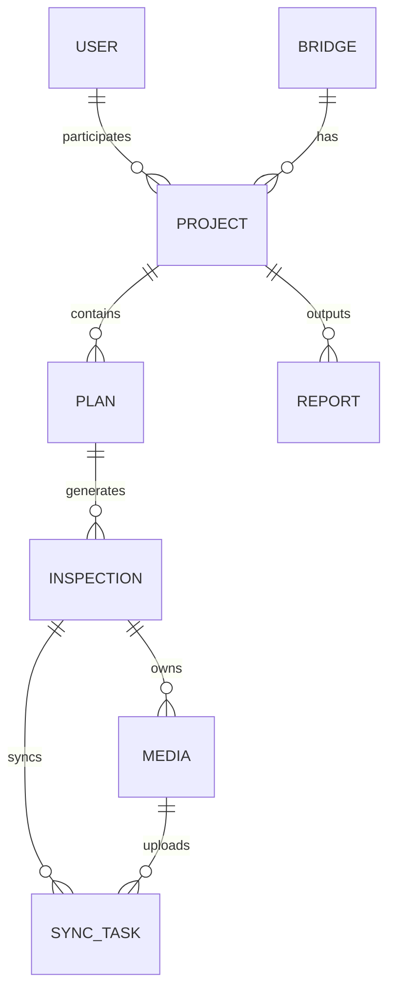

# 桥检AI（BridgeAI）安卓APP 技术方案与开发任务拆解

## 1. 文档目标

本文件用于把MVP PRD转成研发可执行方案，回答四个问题：

1. 安卓APP技术上怎么做。
2. 客户端需要拆成哪些模块。
3. 后端需要提供哪些能力。
4. 研发任务如何拆解和排期。

本文件默认遵循以下判断：

1. 首版只做安卓APP。
2. 先做稳定可用的现场作业闭环。
3. AI先支持模拟闭环，再接真实模型。
4. 不被Web端、iOS、无人机、大屏等后续能力带偏。

---

## 2. 推荐技术路线

## 2.1 客户端形态

推荐：`Android 原生 Kotlin`

原因：

1. 对摄像头、媒体、文件、PDF、本地数据库、后台任务的掌控更强。
2. 更适合弱网和重本地存储的工程现场场景。
3. 更适合未来接入端侧AI模型与硬件能力。

## 2.2 UI框架

推荐：`Jetpack Compose`

原因：

1. 开发效率高。
2. 状态驱动页面更适合多状态页面。
3. 适合快速迭代MVP。

备选：

1. 若团队已有成熟XML体系，可采用 `Compose + View 混合方案`。

## 2.3 架构模式

推荐：`MVVM + Clean-ish 分层`

基础分层建议：

1. `presentation`：Compose页面、ViewModel、UI State
2. `domain`：用例层、业务规则
3. `data`：Repository、本地库、远程接口、同步实现
4. `core`：网络、日志、时间、权限、文件、错误处理

## 2.4 本地存储

推荐：`Room + 文件系统`

用途划分：

1. 结构化业务数据：Room
2. 照片/视频/PDF文件：App私有目录
3. 轻量配置：DataStore

## 2.5 网络层

推荐：

1. `Retrofit`
2. `OkHttp`
3. `Kotlinx Serialization` 或 `Moshi`

## 2.6 后台任务

推荐：`WorkManager`

用途：

1. 数据同步
2. 图片上传
3. 报告生成前预处理
4. 失败重试

## 2.7 相机与媒体

推荐：

1. `CameraX` 负责拍照和录像
2. `MediaStore / SAF` 负责导入相册媒体

## 2.8 AI识别层

MVP建议做成可替换引擎接口：

1. `MockAiEngine`
2. `RemoteAiEngine`
3. `LocalTFLiteAiEngine`

首版优先：

1. 先实现 `MockAiEngine`
2. 预留 `RemoteAiEngine`
3. 真实端侧模型接入放在第二阶段

---

## 3. 总体技术架构



---

## 4. 客户端模块拆分

## 4.1 app

职责：

1. 应用入口
2. 全局初始化
3. 路由和依赖装配

## 4.2 feature-auth

职责：

1. 登录
2. 登录态恢复
3. 用户上下文

## 4.3 feature-task

职责：

1. 任务列表
2. 项目检测页
3. 项目状态展示

## 4.4 feature-bridge

职责：

1. 桥梁列表
2. 桥梁详情
3. 桥梁新增/编辑

## 4.5 feature-inspection

职责：

1. 构件采集
2. 构件结果
3. 人工校核
4. 构件状态流转

## 4.6 feature-report

职责：

1. 报告列表
2. 报告预览
3. 报告编辑
4. PDF导出

## 4.7 feature-profile

职责：

1. 个人中心
2. 设置
3. 帮助中心

## 4.8 feature-sync

职责：

1. 未同步列表
2. 手动同步
3. 同步进度
4. 同步失败处理

## 4.9 core-data

职责：

1. Room实体
2. DAO
3. Repository实现
4. 数据映射

## 4.10 core-network

职责：

1. Retrofit
2. 鉴权
3. 错误码封装

## 4.11 core-media

职责：

1. CameraX封装
2. 媒体文件保存
3. 图片压缩与缩略图

## 4.12 core-ai

职责：

1. AI接口定义
2. mock实现
3. remote实现
4. local model实现预留

## 4.13 core-sync

职责：

1. 同步任务编排
2. 上传队列
3. 重试策略
4. 冲突处理

---

## 5. 客户端核心数据设计

## 5.1 Room实体建议

建议至少建立以下实体：

1. `UserEntity`
2. `BridgeEntity`
3. `ProjectEntity`
4. `PlanEntity`
5. `InspectionEntity`
6. `MediaEntity`
7. `ReportEntity`
8. `SyncTaskEntity`

说明：

1. 不建议把所有照片路径简单塞进Inspection一个JSON字段里。
2. 更推荐把媒体拆成 `MediaEntity`，便于上传、删除、重试和预览。

## 5.2 推荐表关系



## 5.3 InspectionEntity建议字段

1. id
2. projectId
3. planId
4. bridgeId
5. inspectorId
6. componentCategory
7. componentType
8. componentNumber
9. defectType
10. defectLevel
11. locationDesc
12. sizeParamsJson
13. aiStatus
14. aiResultJson
15. inspectionStatus
16. remarks
17. longitude
18. latitude
19. createdAt
20. updatedAt
21. syncStatus

## 5.4 MediaEntity建议字段

1. id
2. inspectionId
3. localPath
4. mediaType
5. thumbnailPath
6. durationMs
7. width
8. height
9. fileSize
10. createdAt
11. syncStatus

这样更利于：

1. 批量上传
2. 失败重试
3. 删除单个素材
4. 统计每个构件的素材数量

---

## 6. 状态机建议

## 6.1 构件状态机

```text
未检测
 -> 已采集
 -> 已识别
 -> 已完成
```

回退规则：

1. 删除全部素材：`已采集/已识别/已完成 -> 未检测`
2. 补拍后待重新识别：`已完成 -> 已采集`
3. 识别失败不回退素材，只回退到 `已采集`

## 6.2 报告状态机

```text
草稿 -> 已完成 -> 已上报
```

约束：

1. `已上报` 报告不可再编辑核心内容。
2. `已完成` 才允许导出正式PDF。

## 6.3 同步状态机

```text
未同步 -> 同步中 -> 已同步
           同步失败 -> 重试中 -> 已同步
```

---

## 7. 后端最小能力清单

虽然首版强调本地闭环，但为了后续真实试点，建议后端尽早按最小集合准备。

## 7.1 认证接口

1. 登录
2. 刷新token
3. 获取当前用户信息

## 7.2 基础数据接口

1. 获取桥梁列表
2. 获取桥梁详情
3. 创建/更新桥梁
4. 获取项目列表
5. 创建项目
6. 获取构件计划
7. 保存构件计划

## 7.3 检测数据接口

1. 上传检测记录
2. 上传媒体文件
3. 获取检测记录详情
4. 获取项目进度

## 7.4 AI接口

1. 提交识别任务
2. 查询识别结果

## 7.5 报告接口

1. 触发报告生成
2. 获取报告详情
3. 更新报告备注/建议/签字信息
4. 标记报告已上报
5. 获取PDF下载地址

---

## 8. AI实现策略

## 8.1 MVP阶段

优先实现：

1. 本地mock识别
2. 统一AI接口层
3. 识别结果结构冻结

好处：

1. 产品流程先稳定。
2. UI和数据结构不依赖真实模型成熟度。
3. 后续接入真实引擎时改动可控。

## 8.2 二阶段

接入真实AI能力时建议：

1. 先做服务端识别版本。
2. 后评估端侧TFLite版本。

理由：

1. 模型更新更灵活。
2. 调试更方便。
3. 适合先验证识别效果。

## 8.3 三阶段

在端侧性能和模型收敛后，再补：

1. 本地模型推理
2. 模型版本管理
3. 本地识别与远端识别策略切换

---

## 9. 同步方案建议

## 9.1 同步原则

1. 先同步元数据，后同步媒体。
2. 失败不丢失本地记录。
3. 所有同步任务可重试。
4. 以任务队列驱动同步，不以页面逻辑驱动同步。

## 9.2 SyncTask设计

建议同步任务粒度如下：

1. `UPLOAD_INSPECTION`
2. `UPLOAD_MEDIA`
3. `UPDATE_REPORT`
4. `FETCH_AI_RESULT`

字段建议：

1. taskId
2. bizType
3. bizId
4. payloadJson
5. taskStatus
6. retryCount
7. lastError
8. createdAt
9. updatedAt

## 9.3 WorkManager策略

建议：

1. WiFi优先上传大媒体文件。
2. 弱网环境下只传元数据。
3. 可由用户在同步页手动触发“立即同步”。

---

## 10. PDF与报告生成方案

## 10.1 MVP实现建议

先采用：

1. 结构化报告JSON
2. 模板化渲染
3. 安卓端生成PDF

可选路线：

1. HTML模板转PDF
2. Android Canvas/PdfDocument生成

MVP推荐：

1. 内容数据先统一为JSON。
2. 模板层采用HTML模板生成更快。

## 10.2 报告拆分

报告生成建议拆为3步：

1. 聚合Inspection数据
2. 生成ReportContent JSON
3. 渲染为预览和PDF

这样可以保证：

1. 预览与PDF同源
2. 后续Web后台复用同一报告结构

---

## 11. 日志与埋点建议

MVP也建议保留最小埋点和日志。

## 11.1 关键埋点

1. 登录成功/失败
2. 项目进入
3. 构件采集开始
4. 素材保存成功/失败
5. AI识别触发/成功/失败
6. 构件完成
7. 手动同步开始/完成/失败
8. 报告生成成功/失败
9. PDF导出成功/失败

## 11.2 日志重点

1. 摄像头异常
2. 文件写入失败
3. 数据库存取失败
4. 同步冲突
5. PDF生成失败

---

## 12. 开发任务拆解

## 12.1 第0阶段：基线冻结

目标：

1. 冻结PRD
2. 冻结页面清单
3. 冻结数据结构

任务：

1. 输出API草案
2. 输出页面跳转图
3. 输出实体定义
4. 输出状态机定义

## 12.2 第1阶段：工程骨架

目标：

1. 搭建安卓工程基础设施

任务：

1. 初始化多模块工程
2. 集成Compose、Navigation、Hilt、Room、Retrofit、WorkManager
3. 搭建基础主题和组件库
4. 搭建日志、错误封装、网络基础层

交付：

1. 可运行空壳工程
2. 基础路由跑通

## 12.3 第2阶段：本地数据闭环

目标：

1. 跑通桥梁、项目、构件、检测记录的本地闭环

任务：

1. 实现Room实体和DAO
2. 实现Repository
3. 初始化本地样例数据
4. 完成桥梁列表/详情
5. 完成项目检测页

交付：

1. 用户可从桥梁进入构件列表

## 12.4 第3阶段：采集闭环

目标：

1. 跑通构件采集与保存

任务：

1. CameraX封装
2. 相册导入
3. 媒体文件保存
4. 素材网格展示
5. 删除与补拍逻辑

交付：

1. 可针对单个构件完成拍照和本地保存

## 12.5 第4阶段：识别与校核闭环

目标：

1. 让构件从采集走到可交付记录

任务：

1. MockAiEngine实现
2. AI结果页
3. 人工编辑表单
4. 构件状态机
5. 标记构件完成

交付：

1. 单个构件可形成完整检测记录

## 12.6 第5阶段：任务与角色闭环

目标：

1. 让多人和项目关系成立

任务：

1. 登录页
2. 用户上下文
3. 任务列表页
4. 项目创建页
5. 构件计划编辑页
6. 基础角色差异处理

交付：

1. 组长可创建项目并分配任务

## 12.7 第6阶段：同步闭环

目标：

1. 让本地数据能够可靠归集

任务：

1. SyncTaskEntity
2. WorkManager同步任务
3. 数据同步页
4. 上传重试
5. 同步状态刷新

交付：

1. 未同步数据可一键上传并回写状态

## 12.8 第7阶段：报告闭环

目标：

1. 让项目从“有数据”变成“有交付”

任务：

1. 报告列表页
2. 报告预览页
3. 报告编辑能力
4. 报告数据聚合器
5. PDF导出

交付：

1. 生成并导出正式报告PDF

## 12.9 第8阶段：稳定性与试点

目标：

1. 进入真实试点前的质量收敛

任务：

1. 异常恢复
2. 性能优化
3. 数据一致性检查
4. 崩溃与日志治理
5. 用户试点问题修复

---

## 13. 研发角色分工建议

## 13.1 安卓端

负责：

1. 页面与交互
2. 本地数据库
3. 媒体采集
4. 同步调度
5. 报告预览与PDF

## 13.2 后端

负责：

1. 认证
2. 桥梁/项目/计划接口
3. 检测数据接收
4. AI识别任务接口
5. 报告生成服务

## 13.3 算法

负责：

1. 病害标签体系统一
2. AI结果结构定义
3. mock到真实模型的过渡
4. 模型版本与精度评估

## 13.4 测试

负责：

1. 主流程回归
2. 弱网/离线场景
3. 媒体采集稳定性
4. 同步重试
5. 报告正确性

---

## 14. 测试重点清单

## 14.1 功能测试

1. 登录与登录态恢复
2. 桥梁创建与查看
3. 项目创建与构件计划
4. 构件拍照录像
5. AI识别状态更新
6. 人工修正保存
7. 同步与重试
8. 报告生成与导出

## 14.2 异常测试

1. 拍照中切后台
2. 录制中来电
3. 网络断开
4. 磁盘空间不足
5. 同步中APP重启
6. PDF生成失败

## 14.3 场景测试

1. 无网采集后回网同步
2. 单桥多构件连续作业
3. 多检测员同项目数据汇总
4. 已完成构件补拍后重新识别

---

## 15. 里程碑建议

| 里程碑 | 目标 | 建议周期 |
| --- | --- | --- |
| M0 | PRD、页面、实体冻结 | 1周 |
| M1 | 本地数据闭环 | 2周 |
| M2 | 采集与识别闭环 | 2周 |
| M3 | 任务与角色闭环 | 2周 |
| M4 | 同步闭环 | 2周 |
| M5 | 报告与PDF闭环 | 2周 |
| M6 | 稳定性与试点版本 | 2周 |

---

## 16. 当前最重要的技术决策

如果只能先定3件事，我建议优先定：

1. `原生Kotlin + Compose`
2. `Room + 文件系统 + WorkManager`
3. `AI引擎抽象接口，首版先mock`

只要这3件事定住，后面的实现路线会很稳，不容易因为文档噪音或后续扩展想象而反复返工。

---

## 17. 本文结论

桥检AI安卓MVP最合理的研发策略是：

`先把本地作业系统做稳，再把AI、同步、报告逐层接上；先做成一个可靠的工程工具，再去追求更大的平台能力。`
