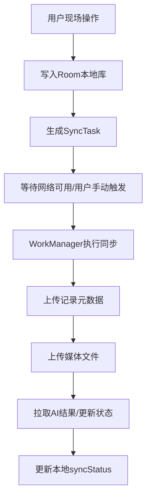

# 桥检AI（BridgeAI）安卓APP 离线同步状态机与冲突处理设计

## 1. 文档目标

本文件用于冻结桥检AI安卓APP的离线同步设计，解决以下问题：

1. 无网现场如何持续作业。
2. 回网后数据如何安全同步。
3. 同步失败如何重试。
4. 本地与服务端冲突如何处理。
5. 哪些状态必须可视化给用户。

---

## 2. 设计原则

1. `离线优先`：现场检测不能依赖网络。
2. `本地先落库`：所有用户操作先写本地数据库。
3. `同步异步化`：同步由队列和后台任务驱动，不阻塞用户主流程。
4. `失败不丢数据`：同步失败只改变状态，不删除本地数据。
5. `人工结果优先`：人工修正结果优先级高于AI建议结果。
6. `幂等优先`：通过客户端唯一ID避免重复创建。

---

## 3. 同步对象范围

MVP阶段需要同步的对象：

1. 检测记录
2. 媒体文件
3. AI识别任务结果
4. 报告编辑内容
5. 报告状态变更

不需要由客户端主动同步的对象：

1. 桥梁档案主数据
2. 项目主数据
3. 检测计划主数据

这些通常由服务端下发，客户端拉取更新。

---

## 4. 总体同步流程



---

## 5. 同步状态机

## 5.1 业务对象通用同步状态

适用于：

1. InspectionRecord
2. InspectionMedia
3. Report
4. ReportRevision

状态定义：

1. `pending`
2. `syncing`
3. `synced`
4. `failed`

状态说明：

| 状态 | 含义 |
| --- | --- |
| pending | 已写本地，待上传 |
| syncing | 正在同步 |
| synced | 同步完成 |
| failed | 同步失败，待重试 |

## 5.2 SyncTask 状态机

```text
pending -> running -> success
pending -> running -> failed -> pending
failed -> running -> success
```

说明：

1. `success` 表示任务完成，可清理或归档。
2. `failed` 表示本轮失败，但业务数据仍保留。
3. 可通过重试策略把 `failed` 再放回 `pending`。

## 5.3 构件检测状态机与同步关系

```text
未检测 -> 已采集 -> 已识别 -> 已完成
```

同步对页面状态的影响：

1. `构件状态` 由业务完成度决定
2. `同步状态` 由上传结果决定
3. 两者不能混为一个字段

例如：

1. 构件可为 `已完成`
2. 同时记录仍是 `pending` 或 `failed`

---

## 6. 推荐同步顺序

## 6.1 单条检测记录同步顺序

1. 上传检测记录元数据
2. 得到服务端 `record_id`
3. 上传该记录关联媒体
4. 更新媒体远端URL
5. 若配置为远端AI，提交AI任务
6. 轮询或拉取AI结果
7. 更新本地记录 `aiStatus`
8. 将该条记录标记为 `synced`

## 6.2 项目级同步顺序

1. 先同步所有 `InspectionRecord`
2. 再同步所有 `InspectionMedia`
3. 再处理 `AI结果回填`
4. 最后处理 `Report` 和 `ReportRevision`

原因：

1. 报告依赖记录完整性
2. 媒体依赖记录存在
3. AI任务依赖记录和媒体存在

---

## 7. SyncTask 拆分规则

建议一个业务动作拆成多个独立同步任务，而不是“一把梭上传整个项目”。

推荐任务类型：

1. `UPLOAD_INSPECTION_RECORD`
2. `UPLOAD_INSPECTION_MEDIA`
3. `PULL_AI_RESULT`
4. `UPLOAD_REPORT`
5. `UPLOAD_REPORT_REVISION`
6. `CHANGE_REPORT_STATUS`

好处：

1. 错误定位更清晰
2. 可针对失败节点单独重试
3. 用户同步页更容易展示进度

---

## 8. 幂等策略

## 8.1 检测记录幂等

通过 `clientRecordId` 保证客户端重复提交不会重复建记录。

规则：

1. 安卓端创建记录时先生成 UUID 风格 `clientRecordId`
2. 服务端对 `(clientRecordId, projectId)` 建唯一约束或幂等逻辑
3. 若重复提交，返回已有 `record_id`

## 8.2 媒体幂等

通过 `clientMediaId` 保证同一张本地图片不会重复上传为多条媒体记录。

## 8.3 报告编辑幂等

通过 `revisionId` 或本地生成的 `clientRevisionId` 避免重复写历史。

---

## 9. 冲突类型与处理规则

## 9.1 冲突类型A：本地有修改，服务端也有修改

场景：

1. 检测员本地修改了位置描述
2. 同时另一端也改了同一条记录

MVP处理建议：

1. 若本地记录未同步，本地优先保留
2. 服务端版本先缓存，不自动覆盖本地
3. 标记为 `conflict` 提示负责人处理

MVP简化做法：

1. 普通检测记录原则上只允许单人编辑
2. 通过角色和流程降低冲突概率

## 9.2 冲突类型B：服务端记录已存在，本地重复上传

处理：

1. 通过 `clientRecordId` 识别
2. 服务端返回已有记录ID
3. 本地把 `serverId` 回填即可

## 9.3 冲突类型C：报告状态冲突

场景：

1. 本地还在编辑草稿
2. 服务端已被组长标记为已完成或已上报

处理：

1. 一旦服务端状态为 `reported`，客户端只允许查看，不允许覆盖上传
2. 返回 `conflict` 错误码
3. 页面提示“报告状态已变化，请刷新后查看”

## 9.4 冲突类型D：媒体缺失

场景：

1. 检测记录已上传成功
2. 其中某几张媒体上传失败

处理：

1. 记录不回退为失败删除
2. 仅媒体任务标记 `failed`
3. 构件展示“已完成，部分素材未同步”

---

## 10. 用户可见状态设计

## 10.1 项目列表提示

若项目存在未同步数据，卡片应提示：

1. `有未同步数据`
2. 或显示角标数量

## 10.2 构件列表提示

构件业务状态与同步状态同时表达：

1. 已完成
2. 待同步

不能只显示“已完成”，否则用户会误以为已经上云。

## 10.3 我的-同步页提示

同步页必须清晰展示：

1. 待同步记录数
2. 待同步媒体数
3. 失败任务数
4. 当前网络状态
5. 最后同步时间

---

## 11. WorkManager 触发策略

## 11.1 自动触发

可自动触发的场景：

1. APP回到前台且检测到网络可用
2. 设备连接WiFi
3. 用户关闭离线模式

## 11.2 手动触发

用户在同步页点击：

1. `立即同步`

手动触发优先级高于后台定时。

## 11.3 不建议自动触发的场景

1. 刚拍照完成立即上传大文件
2. 移动网络下自动上传大量媒体
3. 电量极低时自动触发大批量同步

---

## 12. 重试策略建议

## 12.1 通用重试

建议指数退避：

1. 第1次失败后：30秒
2. 第2次失败后：2分钟
3. 第3次失败后：10分钟
4. 超过最大次数后保持 failed，等待手动重试

## 12.2 最大重试次数

建议：

1. 元数据任务：5次
2. 媒体上传任务：3次
3. 报告状态变更任务：5次

---

## 13. AI结果回填策略

AI识别若为服务端执行，建议流程：

1. 客户端同步完成记录与媒体
2. 创建 `PULL_AI_RESULT` 任务
3. 周期性查询AI结果
4. 若成功，写入 `aiResultJson` 和 `aiStatus=done`
5. 若失败，`aiStatus=failed`，允许用户重试

页面规则：

1. `aiStatus=failed` 不影响查看原素材
2. 用户仍可手工填写结果并继续作业

---

## 14. 报告同步策略

## 14.1 报告草稿

1. 本地编辑后立即写本地库
2. 生成 `UPLOAD_REPORT` 或 `UPLOAD_REPORT_REVISION`

## 14.2 报告完成

1. 组长点击确认完成
2. 本地先更新状态
3. 再发 `CHANGE_REPORT_STATUS`

## 14.3 报告上报

1. 一旦服务端确认 `reported`
2. 本地应同步锁定报告编辑入口

---

## 15. 数据恢复与异常处理

## 15.1 APP崩溃后恢复

要求：

1. 已保存本地记录不能丢
2. 未执行完的 SyncTask 应在下次启动时恢复
3. 正在同步中的任务若中断，应回退到 `pending`

## 15.2 网络波动

要求：

1. 断网不清空同步队列
2. 媒体上传中断后支持重试
3. 不因单个媒体失败阻塞所有项目查看

## 15.3 文件丢失

若本地媒体文件被删除或损坏：

1. 标记对应媒体任务为 `failed`
2. 在构件结果页提示“部分素材不可用”
3. 允许用户补拍替代

---

## 16. 同步页建议展示结构

建议分成4个区块：

1. 网络状态
2. 汇总统计
3. 进行中任务
4. 失败任务/待同步任务

推荐字段：

1. 待同步记录数
2. 待同步媒体数
3. 失败任务数
4. 最后同步成功时间
5. 当前是否WiFi

---

## 17. 开始编码前应冻结的同步结论

这些结论建议直接冻结：

1. 本地操作先落库，再同步。
2. 记录、媒体、报告采用独立 SyncTask。
3. `clientRecordId` 和 `clientMediaId` 是同步幂等核心。
4. 业务状态和同步状态必须分离。
5. 报告一旦 `reported`，客户端禁止继续覆盖编辑。

---

## 18. 本文结论

桥检AI的离线同步设计重点不是“自动上传有多聪明”，而是：

`用户在任何弱网或断网场景下都能继续检测，并且在回网后可靠地把本地成果送到服务端，不丢、不乱、不重复。`
