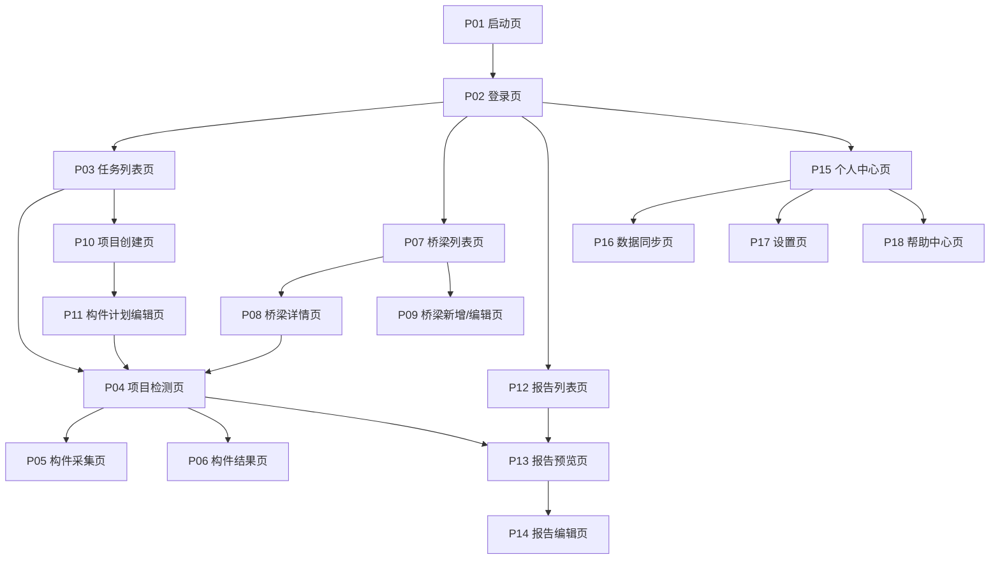

# 桥检AI（BridgeAI）安卓APP 页面级PRD与交互状态表

## 1. 文档目的

本文件在MVP PRD基础上继续下钻到页面级，明确：

1. 安卓APP需要有哪些页面。
2. 每个页面的业务职责是什么。
3. 页面之间如何跳转。
4. 每个页面必须覆盖哪些状态。
5. 哪些交互是首版必须实现的。

本文件默认以前一版MVP PRD为唯一基线，不再接受旧版“首页直接拍照即主流程”的设计逻辑。

---

## 2. 页面总览

### 2.1 一级导航

MVP底部Tab固定为4个：

1. `任务`
2. `桥梁`
3. `报告`
4. `我的`

### 2.2 页面清单

| 页面ID | 页面名称 | 所属模块 | 优先级 | 是否首版必须 |
| --- | --- | --- | --- | --- |
| P01 | 启动页 | 通用 | P0 | 是 |
| P02 | 登录页 | 通用 | P0 | 是 |
| P03 | 任务列表页 | 任务 | P0 | 是 |
| P04 | 项目检测页 | 任务 | P0 | 是 |
| P05 | 构件采集页 | 检测 | P0 | 是 |
| P06 | 构件结果页 | 检测 | P0 | 是 |
| P07 | 桥梁列表页 | 桥梁 | P0 | 是 |
| P08 | 桥梁详情页 | 桥梁 | P0 | 是 |
| P09 | 桥梁新增/编辑页 | 桥梁 | P1 | 建议首版做基础版 |
| P10 | 项目创建页 | 任务 | P0 | 是 |
| P11 | 构件计划编辑页 | 任务 | P0 | 是 |
| P12 | 报告列表页 | 报告 | P0 | 是 |
| P13 | 报告预览页 | 报告 | P0 | 是 |
| P14 | 报告编辑页 | 报告 | P1 | 可与预览页合并基础版 |
| P15 | 个人中心页 | 我的 | P0 | 是 |
| P16 | 数据同步页 | 我的 | P0 | 是 |
| P17 | 设置页 | 我的 | P1 | 可简化 |
| P18 | 帮助中心页 | 我的 | P1 | 可简化 |

---

## 3. 页面关系图

---

## 4. 页面级定义

## 4.1 P01 启动页

### 页面目标

完成冷启动、登录态判断、本地数据库初始化和基础配置加载。

### 核心内容

1. 品牌Logo
2. 启动动画或静态品牌页
3. 初始化提示

### 页面行为

1. 检查本地token与用户信息。
2. 初始化本地数据库。
3. 进入登录页或任务列表页。

### 必须状态

1. 初始化中
2. 初始化失败
3. 自动登录成功
4. 自动登录失败

### 退出去向

1. 已登录 -> `P03 任务列表页`
2. 未登录 -> `P02 登录页`

---

## 4.2 P02 登录页

### 页面目标

完成用户登录并建立用户上下文。

### 页面元素

1. 用户名/手机号输入框
2. 密码输入框
3. 登录按钮
4. 记住登录态

### 业务规则

1. 首版支持账号密码登录。
2. 登录成功后缓存用户信息和角色。
3. 离线状态不允许首次登录，但允许已登录用户继续进入APP。

### 必须状态

1. 默认输入态
2. 输入校验失败
3. 登录中
4. 登录失败
5. 登录成功
6. 网络不可用且无缓存登录态

---

## 4.3 P03 任务列表页

### 页面目标

成为检测员和组长进入检测主流程的第一入口。

### 页面元素

1. 顶部标题
2. 项目状态切换：待开始、进行中、已完成
3. 项目卡片列表
4. 组长可见的“新建项目”按钮

### 项目卡片字段

1. 项目名称
2. 桥梁名称
3. 项目类型
4. 起止时间
5. 负责人
6. 完成进度
7. 我的任务数量
8. 项目状态

### 关键动作

1. 点击项目卡片 -> `P04 项目检测页`
2. 点击新建项目 -> `P10 项目创建页`

### 必须状态

1. 首次加载中
2. 列表为空
3. 正常列表
4. 下拉刷新
5. 本地有缓存但网络不可用
6. 加载失败

### 首版交互约束

1. 检测员默认只看与自己相关项目。
2. 组长默认看自己负责项目。
3. 若项目存在未同步本地记录，需要在卡片上提示。

---

## 4.4 P04 项目检测页

### 页面目标

作为单个桥梁检测项目的总控页面，承载构件级作业入口和项目进度。

### 页面结构

1. 桥梁基础信息区
2. 项目统计区
3. 批量AI识别区
4. 构件分组列表
5. 底部操作区

### 桥梁基础信息区

展示：

1. 桥梁名称
2. 桥梁编码
3. 结构类型
4. 长度/宽度/建成年份

### 项目统计区

展示：

1. 总构件数
2. 已采集构件数
3. 已识别构件数
4. 已完成构件数
5. 进度条

### 构件项字段

1. 构件分类
2. 构件名称
3. 构件编号
4. 当前状态
5. 已拍素材数量
6. 操作按钮

### 构件状态定义

1. `未检测`
2. `已采集`
3. `已识别`
4. `已完成`

### 关键动作

1. 点击未检测构件 -> `P05 构件采集页`
2. 点击已采集/已识别/已完成构件 -> `P06 构件结果页`
3. 点击批量AI识别 -> 对待识别构件统一处理
4. 点击生成报告 -> `P13 报告预览页` 或触发生成流程

### 必须状态

1. 加载中
2. 无构件计划
3. 有构件但尚未开始
4. 检测进行中
5. 全部完成可生成报告
6. 批量识别中
7. 批量识别失败

### 关键交互约束

1. 构件列表必须支持长列表滚动。
2. 状态颜色必须固定统一。
3. 所有识别与完成状态变化都要即时刷新统计区。

---

## 4.5 P05 构件采集页

### 页面目标

针对具体构件完成拍照、录像、导入和素材管理。

### 页面元素

1. 顶部返回与保存
2. 当前桥梁与构件信息
3. 取景区域
4. 拍照按钮
5. 录像按钮
6. 相册导入按钮
7. 已采素材网格

### 核心业务规则

1. 所有素材自动归档到当前构件。
2. 支持多张照片和视频并存。
3. 保存前允许删除不合格素材。
4. 退出页面前若有未保存素材要提示。

### 必须状态

1. 摄像头准备中
2. 摄像头不可用
3. 拍照模式
4. 录像模式
5. 录制中
6. 有素材未保存
7. 保存成功
8. 保存失败

### 异常场景

1. 权限拒绝
2. 摄像头被占用
3. 本地空间不足
4. 媒体写入失败

---

## 4.6 P06 构件结果页

### 页面目标

查看AI识别结果并完成人工校核，形成正式检测记录。

### 页面元素

1. 顶部返回、编辑、保存
2. 素材区域
3. AI结果卡片
4. 病害表单
5. 重新拍摄入口

### 病害表单字段

1. 病害类型
2. 病害等级
3. 位置描述
4. 尺寸参数
5. 备注

### 关键动作

1. 进入编辑模式
2. 保存人工修正结果
3. 删除照片
4. 补拍并回到采集页
5. 标记构件完成

### 必须状态

1. 首次加载中
2. 尚未识别
3. 已识别待校核
4. 编辑中
5. 保存成功
6. 保存失败
7. 构件已完成

### 交互约束

1. 人工修正优先级高于AI结果。
2. 若没有病害也要允许明确记录“未发现病害”。
3. 删除所有素材后，构件状态应回退为未检测或待补采。

---

## 4.7 P07 桥梁列表页

### 页面目标

提供桥梁档案检索、查看和启动检测入口。

### 页面元素

1. 搜索框
2. 筛选按钮
3. 桥梁卡片列表
4. 新增桥梁按钮

### 桥梁卡片字段

1. 桥梁名称
2. 编码
3. 结构类型
4. 建成年份
5. 最近检测状态
6. 开始检测按钮

### 必须状态

1. 加载中
2. 空列表
3. 正常列表
4. 搜索无结果
5. 加载失败

---

## 4.8 P08 桥梁详情页

### 页面目标

展示桥梁档案完整信息，并作为从桥梁维度启动检测的入口。

### 页面结构

1. 桥梁摘要卡
2. 基本信息区
3. 位置信息区
4. 尺寸参数区
5. 历史检测记录区
6. 关联报告区
7. 底部开始检测按钮

### 必须状态

1. 加载中
2. 桥梁不存在
3. 正常详情
4. 历史记录为空

---

## 4.9 P09 桥梁新增/编辑页

### 页面目标

由管理员或组长新增和维护桥梁档案。

### 表单字段

1. 桥梁名称
2. 桥梁编码
3. 所属路线
4. 桥梁类型
5. 结构类型
6. 建成年份
7. 总长
8. 桥宽
9. 主跨
10. 地址
11. 养护单位
12. 备注

### 必须状态

1. 新增模式
2. 编辑模式
3. 校验失败
4. 保存中
5. 保存成功
6. 保存失败

---

## 4.10 P10 项目创建页

### 页面目标

由组长创建检测项目。

### 表单字段

1. 项目名称
2. 关联桥梁
3. 项目类型
4. 开始日期
5. 结束日期
6. 项目负责人
7. 检测员列表

### 必须状态

1. 初始态
2. 表单校验失败
3. 保存中
4. 保存成功
5. 保存失败

---

## 4.11 P11 构件计划编辑页

### 页面目标

把项目拆分为构件级任务。

### 页面元素

1. 构件模板分组
2. 新增构件按钮
3. 构件配置表单
4. 检测员分配控件
5. 保存计划按钮

### 构件配置字段

1. 构件分类
2. 构件类型
3. 构件编号
4. 重点病害类型
5. 指派检测员

### 必须状态

1. 默认模板态
2. 有修改未保存
3. 保存成功
4. 保存失败

---

## 4.12 P12 报告列表页

### 页面目标

集中查看项目报告，并执行预览、导出和状态查看。

### 页面元素

1. 搜索框
2. 状态筛选
3. 报告卡片列表

### 报告卡片字段

1. 报告名称
2. 关联桥梁
3. 检测日期
4. 报告状态
5. 导出按钮

### 必须状态

1. 加载中
2. 空状态
3. 有列表
4. 搜索无结果
5. 导出中
6. 导出失败

---

## 4.13 P13 报告预览页

### 页面目标

查看报告完整内容，并执行编辑、导出、上报。

### 页面结构

1. 顶部标题栏
2. 报告摘要区
3. 正文滚动区
4. 底部操作区

### 正文至少包含

1. 项目概况
2. 桥梁信息
3. 检测概况
4. 病害清单
5. 技术状况评定
6. 养护建议
7. 签字栏

### 关键动作

1. 编辑报告
2. 导出PDF
3. 标记已上报

### 必须状态

1. 加载中
2. 草稿
3. 已完成
4. 已上报
5. 导出中
6. 上报中
7. 上报失败

---

## 4.14 P14 报告编辑页

### 页面目标

对报告中的可编辑部分进行修改。

### 可编辑区域

1. 病害备注
2. 养护建议
3. 签字信息

### 不可编辑区域

1. 原始病害数据
2. 原始素材
3. 构件归属信息

### 必须状态

1. 编辑中
2. 未保存修改
3. 保存成功
4. 保存失败

---

## 4.15 P15 个人中心页

### 页面目标

承载用户信息、离线模式入口、同步入口和常用设置入口。

### 页面元素

1. 用户卡片
2. 本月统计
3. 离线模式开关
4. 数据同步入口
5. 设置入口
6. 帮助中心入口
7. 退出登录按钮

### 必须状态

1. 用户信息加载中
2. 正常展示
3. 离线模式开启
4. 离线模式关闭

---

## 4.16 P16 数据同步页

### 页面目标

明确告诉用户“还有哪些数据没上传”，并支持手动同步。

### 页面结构

1. 网络状态卡片
2. 未同步数量卡片
3. 同步按钮
4. 进度条
5. 未同步记录列表

### 必须状态

1. 无未同步数据
2. 有未同步数据
3. 同步中
4. 同步成功
5. 同步失败
6. 网络不可用

### 关键交互约束

1. 同步失败不得丢数据。
2. 同步中应禁止重复点击。
3. 同步完成后要即时刷新角标和项目状态。

---

## 4.17 P17 设置页

### 基础内容

1. 模型版本
2. 检查更新
3. 缓存清理
4. 隐私协议
5. 关于我们

---

## 4.18 P18 帮助中心页

### 基础内容

1. 首次使用指引
2. 检测流程说明
3. 常见问题
4. 联系支持

---

## 5. 全局状态规范

所有P0页面必须统一处理以下状态：

1. `Loading`：首次数据加载中
2. `Empty`：列表或内容为空
3. `Error`：接口或本地数据异常
4. `Offline`：网络不可用但本地仍可读
5. `Syncing`：同步进行中
6. `Disabled`：权限不足或条件未满足

---

## 6. 全局弹窗与反馈规范

### 6.1 必须使用弹窗确认的动作

1. 删除素材
2. 删除桥梁
3. 退出未保存编辑页
4. 退出登录
5. 标记报告已上报

### 6.2 必须使用Toast或顶部提示的动作

1. 保存成功
2. 保存失败
3. 同步成功
4. 同步失败
5. 权限不足
6. 网络不可用

---

## 7. 页面级验收重点

### 7.1 产品验收重点

1. 用户是否能自然地从任务或桥梁进入构件检测。
2. 用户是否始终知道自己在检测哪个桥、哪个项目、哪个构件。
3. 报告链路是否明确可达。

### 7.2 设计验收重点

1. 页面信息密度是否适合现场使用。
2. 重要按钮是否足够大。
3. 状态颜色和反馈是否统一。

### 7.3 安卓验收重点

1. 页面跳转参数是否完整。
2. 页面返回后状态是否丢失。
3. 采集页和结果页的媒体数据是否稳定保存。

---

## 8. 本文结论

桥检AI的页面设计必须围绕 `任务/桥梁/构件` 展开，而不是围绕“相机能力”展开。

页面设计是否正确，只看一个标准：

`用户能不能在任何时刻都清楚知道：我正在为哪座桥、哪个项目、哪个构件工作，以及这些数据最终会进入哪份报告。`
