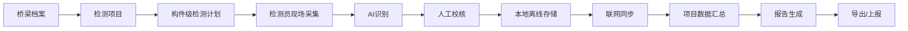

# 桥检AI（BridgeAI）项目全景认知与研发路线图

## 1. 项目本质

桥检AI不是一个“桥梁裂缝识别小工具”，也不是一个“小程序式拍照应用”。

它更准确的定义是：

`面向桥梁检测场景的安卓端现场作业系统`

系统的核心目标不是单纯识别，而是完成以下闭环：

1. 任务组织
2. 构件级采集
3. AI辅助识别
4. 人工校核
5. 离线存储与同步
6. 标准化报告输出

---

## 2. 为什么这个项目成立

传统桥梁检测存在4个核心问题：

1. 照片与构件脱节，后续整理成本高。
2. 现场记录依赖经验和手工，标准化弱。
3. 弱网和户外环境下常规在线系统不可用。
4. 检测数据到最终报告之间存在大量重复劳动。

桥检AI要解决的不是单点问题，而是把这些断点连成一个可执行、可追溯、可交付的作业链。

---

## 3. 全景认知图

这个链路里，真正不能断的节点是：

1. 构件级采集
2. 人工校核
3. 离线存储
4. 报告生成

AI很重要，但它不是唯一决定成败的节点。

---

## 4. 产品分层认知

### 4.1 第一层：现场作业层

这是MVP最核心的一层。

包含：

1. 任务进入
2. 构件列表
3. 拍照录像
4. AI识别
5. 结果修正

### 4.2 第二层：数据组织层

这是把“工具”变成“系统”的关键层。

包含：

1. 桥梁档案
2. 项目与计划
3. 构件归属
4. 同步状态
5. 报告数据模型

### 4.3 第三层：交付输出层

这是直接面向项目负责人和业主交付的一层。

包含：

1. 报告草稿
2. 技术状况评定
3. 养护建议
4. PDF导出
5. 上报留痕

### 4.4 第四层：平台扩展层

这层不属于MVP，但属于后续战略空间。

包含：

1. 无人机接入
2. iOS端
3. Web管理后台
4. 数据大屏
5. 第三方系统对接
6. 实时监测和传感器融合

---

## 5. 当前应坚持的产品判断

### 5.1 安卓APP，不做小程序思维

要点：

1. 安卓APP能更稳定地调用摄像头、存储、文件、PDF、后台同步能力。
2. 现场桥检是长流程、重数据、弱网业务，不适合小程序式轻交互范式。
3. 安卓设备在工程现场的普及度更高，也更符合首版落地条件。

### 5.2 主入口应该是任务和桥梁，不是“拍照按钮”

如果把拍照做成首页主入口，会带来3个问题：

1. 照片容易失去构件归属。
2. 用户先拍后整理，回到传统低效模式。
3. 后续报告汇总会变得不稳定。

因此产品主入口应是：

1. 任务
2. 桥梁
3. 构件

### 5.3 AI必须服从作业流程

AI是加速器，不是主流程设计的起点。

正确顺序应该是：

1. 先设计作业结构。
2. 再把AI嵌入结构。

而不是：

1. 先做一个识图功能。
2. 再勉强往项目和报告上拼。

---

## 6. 功能优先级

## 6.1 P0：必须做

这些能力决定MVP是否成立。

| 功能 | 为什么必须做 |
| --- | --- |
| 安卓端登录与用户上下文 | 决定任务、数据归属与角色识别 |
| 桥梁档案管理 | 决定所有数据挂载的基础对象 |
| 检测项目与构件计划 | 决定作业是否结构化 |
| 构件级拍照/录像/导入 | 决定现场采集是否可执行 |
| AI识别占位与状态流转 | 决定产品闭环是否成立 |
| 人工校核 | 决定工程结果是否可信 |
| 离线存储 | 决定现场是否能真正使用 |
| 手动同步 | 决定本地数据能否归集 |
| 报告生成与PDF导出 | 决定项目是否具备交付价值 |

## 6.2 P1：应该做

这些能力会明显提升体验和管理效率，但不是首版成立前提。

| 功能 | 价值 |
| --- | --- |
| 构件模板库优化 | 降低项目配置成本 |
| 历史报告对比 | 提升复检价值 |
| 更细的审核记录 | 提升可追溯性 |
| 组长视角的项目看板 | 提升进度掌控 |
| AI真实模型接入 | 提升产品真实效率 |
| 报告分享与打印优化 | 提升对外交付体验 |

## 6.3 P2：后续规划

这些能力适合在MVP稳定后推进。

| 功能 | 原因 |
| --- | --- |
| DJI无人机接入 | 技术复杂度高，耦合硬件生态 |
| Web管理后台 | 属于平台增强，不影响现场闭环 |
| iOS版本 | 首版回报率低于安卓 |
| BI大屏与趋势分析 | 依赖持续积累数据 |
| 第三方系统集成 | 需要先稳定自身数据模型 |

---

## 7. 研发路线图

## 7.1 路线原则

路线设计坚持3条原则：

1. 先数据结构，后页面丰富。
2. 先本地闭环，后云端增强。
3. 先安卓单端跑通，后跨端扩展。

## 7.2 建议阶段

### 阶段0：基线收敛

目标：统一产品认知，冻结MVP范围。

输出：

1. 安卓APP版PRD
2. 页面清单
3. 数据实体定义
4. 交互主流程图

建议周期：1周

### 阶段1：本地作业闭环

目标：不依赖真实后端，先在安卓端把检测闭环跑通。

范围：

1. 桥梁列表与详情
2. 项目检测页
3. 构件采集页
4. 构件结果页
5. 本地数据库
6. 模拟AI识别

里程碑：

1. 能完整创建一条构件检测记录。
2. 能本地查看和修改结果。

建议周期：3周

### 阶段2：任务与协同闭环

目标：让项目、计划、人员和状态流转成立。

范围：

1. 项目创建
2. 构件计划模板
3. 任务列表
4. 角色视图差异
5. 状态管理

里程碑：

1. 一名组长可分配任务。
2. 多名检测员可在同一项目下产生数据。

建议周期：2周

### 阶段3：同步与报告闭环

目标：从“能检测”升级到“能交付”。

范围：

1. 数据同步页
2. 同步队列和重试
3. 报告草稿生成
4. 报告预览
5. PDF导出

里程碑：

1. 项目可形成完整报告。
2. 报告可导出并用于交付。

建议周期：3周

### 阶段4：稳定性与试点版本

目标：把原型型产品收敛成可试点的软件版本。

范围：

1. 异常恢复
2. 性能优化
3. 采集稳定性
4. 数据一致性
5. 试点反馈修复

里程碑：

1. 支持真实桥梁项目试用。
2. 支持长时现场作业。

建议周期：2周

### 阶段5：真实AI与二期能力

目标：把产品从“模拟闭环”推进到“真实AI增效”。

范围：

1. YOLO模型或服务接入
2. 模型版本管理
3. 识别性能优化
4. 误识别反馈闭环

建议周期：按算法成熟度独立推进

---

## 8. 推荐研发节奏

如果按一个小团队推进，建议节奏如下：

| 周期 | 重点 |
| --- | --- |
| 第1周 | PRD冻结、页面冻结、数据模型冻结 |
| 第2-4周 | 安卓本地闭环开发 |
| 第5-6周 | 项目/任务/角色流转 |
| 第7-9周 | 同步、报告、PDF |
| 第10-11周 | 测试、优化、试点准备 |
| 第12周以后 | 真实AI接入与第二阶段规划 |

---

## 9. 从原型到产品的关键差距

当前已有原型已经很好地表达了业务方向，但距离正式交付还有以下差距：

1. 当前AI多为模拟结果，尚未形成真实能力。
2. 当前同步更像本地状态变更，不是真正的服务端同步。
3. 当前报告结构有定义，但生成链路仍需正式工程化。
4. 当前角色与项目关系存在临时写法，需收敛到正式数据模型。
5. 当前仍保留旧的“首页拍照”思路残留，需要统一为任务/构件主流程。

---

## 10. 风险与对策

### 10.1 最大风险

1. 需求边界再次膨胀，导致MVP失焦。
2. 过早引入无人机、iOS、Web后台，拖慢首版落地。
3. 只重视AI识别，不重视数据结构和报告生成。
4. 采集流程不统一，导致构件归属混乱。

### 10.2 对策

1. 所有需求评审都以安卓MVP PRD为准。
2. P2能力不进入首版排期。
3. 以“是否促进现场闭环”作为需求取舍标准。
4. 以“是否能形成可交付报告”作为阶段验收标准。

---

## 11. 结论

桥检AI第一阶段最重要的不是“把功能做多”，而是把下面这件事做稳：

`让安卓APP在真实桥检现场，把构件级检测数据可靠地采起来、存下来、改正确、汇总成报告。`

只要这件事做稳，后面的真实AI、无人机、Web后台、iOS和行业平台化，才有坚实基础。
